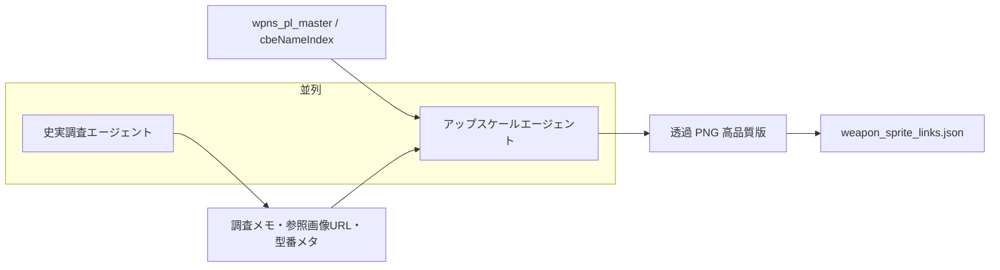

# 武器アセット・装備ロードマップ

**更新**: 2026-05-24  
**方針**: 標準 ST 武器（レガシー）を段階的に廃止し、**PL 由来マスタ（`pl_*` / `WPNS_PL_*`）へ統一**する。見た目は並列エージェントで段階的にグレードアップする。

---

## 1. 歩兵携行品の判定（2026-05 実装）

**正本**: `pl_infantry_loadout.js` → `window.isPlausibleInfantryMainWeapon(code)`

| 除外 | 例 |
|------|-----|
| 車載砲名 | `20mm KwK38`, `88mm KwK43`, `75mm KwK40` |
| 対戦車・牽引 | `75mm PaK40`, `105mm StH42`, `3inGun M5` |
| 高射砲 | `88mm FlaK36` |
| 弾種未整備 | `acceptsAmmo: []` の行（マスタ誤分類の安全網） |
| 弾薬行名 | `45ACP-*`, `3006-*` 単体 |

**今後整理**: `data/infantry_portable_weapons.json`（仮）で **歩兵携行 / 車両 / 陣地火器** の3分類を明示し、ビルドスクリプトとランタイムの両方から参照。

**画像ルール**: サイドバーは `data/sprites/iteml/item_NNNN.png`。未ロード・怪しい名前は装備候補から外す（`plWeaponHasLoadedIcon` は任意チェック）。

---

## 2. レガシー廃止の方向（合意）

| 対象 | 現状 | 方向 |
|------|------|------|
| **Colt M1911** (`m1911`) | `data.js` の `WPNS` + 複数テンプレの `sub` / `opt` | **廃止予定** → PL 拳銃（`WPNS_PL_INFANTRY_SUB_CODES` 等）へ差し替え |
| **Mk2 Grenade** (`nade`) | `rifleman` / `scout` の `opt` 等 | **廃止予定** → PL 手榴弾・投擲装備へ差し替え |
| その他レガシー小銃系 | `m1`, `thompson`, `bar` 等（段階的） | 既存の PL メイン武器プール拡張と同様に、**互換表・装填 UI が整った順**で置換 |

**即時のコード変更は別 PR**。本ドキュメントは**設計方針と順序**の記録。

### 影響しうる箇所（実装時チェックリスト）

- `data.js` — `WPNS`, `UNIT_TEMPLATES`（`sub` / `opt` / `main`）
- `logic_campaign.js` — `createSoldier` の PL プール差し替え、`repairMortarGunnerLoadout` の `opt: m1911` フォールバック
- `phaser_sidebar.js` / `logic_ui.js` — スロット表示（`cbeNameIndex` 前提のアイコン）
- `data/wpns_pl_master_table.csv`, `weapon_sprite_links.json`, `pl_st_weapon_ammo.js`

---

## 3. PL 武器ビジュアル品質 — 並列エージェント計画

**目的**: サイドバー・カード・戦場 UI で「史実に近い・判読できる」アイコン／スプライトにする。

### パイプライン（2 エージェント並列）

| エージェント | 入力 | 出力 | 備考 |
|--------------|------|------|------|
| **史実資料・画像調査** | `wpns_code`, `cbeNameIndex`, 表示名, PL 原文 | 型番・年代・参照写真リンク・「この角度／このパーツが特徴」メモ | ゲーム用 PNG は作らない。正本は `data/weapon_research/`（予定） |
| **リアル方向アップスケール** | 現行 `data/sprites/iteml/` または CBE 抽出 PNG + 調査メモ | ややリアル寄りの透過 PNG（解像度・輪郭・色調） | 史実メモをプロンプト／制約に反映。過度な現代 CG 化は避ける |

**ゲート**: 調査メモと PNG の `wpns_code` が一致していること（`GOAL_pl_weapon_sprites_ja.md` の 1:1 紐づけを維持）。

### 優先キュー（案）

1. インファントリ **副武器・投擲**（M1911 / Mk2 置換先になりうる `pl_*`）
2. 迫撃砲兵まわり（弾薬箱・パーツ・仮想 `m2_mortar` 表示）
3. メイン火器（既存 PL メイン池の高頻度出現分）

---

## 4. 既存ドキュメントとの関係

| ドキュメント | 役割 |
|--------------|------|
| [scripts/pl_decoded/GOAL_pl_weapon_sprites_ja.md](scripts/pl_decoded/GOAL_pl_weapon_sprites_ja.md) | PNG の「正しい」の定義（判読可能・マスタ 1:1） |
| [scripts/pl_decoded/ROADMAP_pl_iteml_weapon_sprites_ja.md](scripts/pl_decoded/ROADMAP_pl_iteml_weapon_sprites_ja.md) | ITEML 抽出・Wave 0–3（バイナリ解析〜初回 PNG） |
| [.cursor/plans/phase3_pl_inheritance.md](.cursor/plans/phase3_pl_inheritance.md) | 武器↔弾薬互換・`plCompat`・装填 UI の設計ゲート |
| **本ファイル** | **ゲーム内装備の PL 統一方針** + **ビジュアル品質のエージェント計画** |

**関係の整理**

- Wave 0–3（既存 ROADMAP）: PL バイナリからの**初回スプライト確保**
- 本ロードマップ §2: その上に載せる**品質グレードアップ**（調査 ⇄ アップスケール並列）
- 本ロードマップ §1: レガシー `m1911` / `nade` 廃止とテンプレ差し替え

---

## 5. 実装フェーズ（案）

| Phase | 内容 | 依存 |
|-------|------|------|
| **A** | 調査エージェント用ディレクトリ雛形 + 優先 20 件の調査メモ | — |
| **B** | アップスケール版 PNG 試作 → `weapon_sprite_links.json` の `image_rgba` 差し替え | A（メモがあれば精度向上） |
| **C** | `UNIT_TEMPLATES` から `m1911` / `nade` 除去、PL `sub`/`opt` 固定 | `WPNS_PL_*` プール整備 |
| **D** | サイドバー：非 PL 武器のフォールバック表示整理（テキストのみ廃止方向） | C |

---

## 6. 新チャットでの引き継ぎ

1. 本ファイル `WEAPON_ASSETS_ROADMAP.md` を開く  
2. 作業種別に応じて併読:  
   - スプライト抽出 → `ROADMAP_pl_iteml_weapon_sprites_ja.md`  
   - 装填・互換 → `phase3_pl_inheritance.md`  
3. 例: *「WEAPON_ASSETS_ROADMAP Phase A。`pl_41`（Astra 系）の史実調査メモ雛形を作って」*

---

*レガシー廃止はプレイバランス・互換表と同時に進める。ビジュアルは並列エージェントで段階投入し、一括差し替えは Phase C 以降を推奨。*
