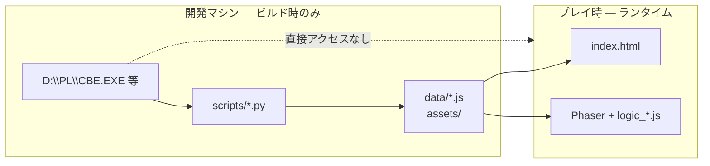
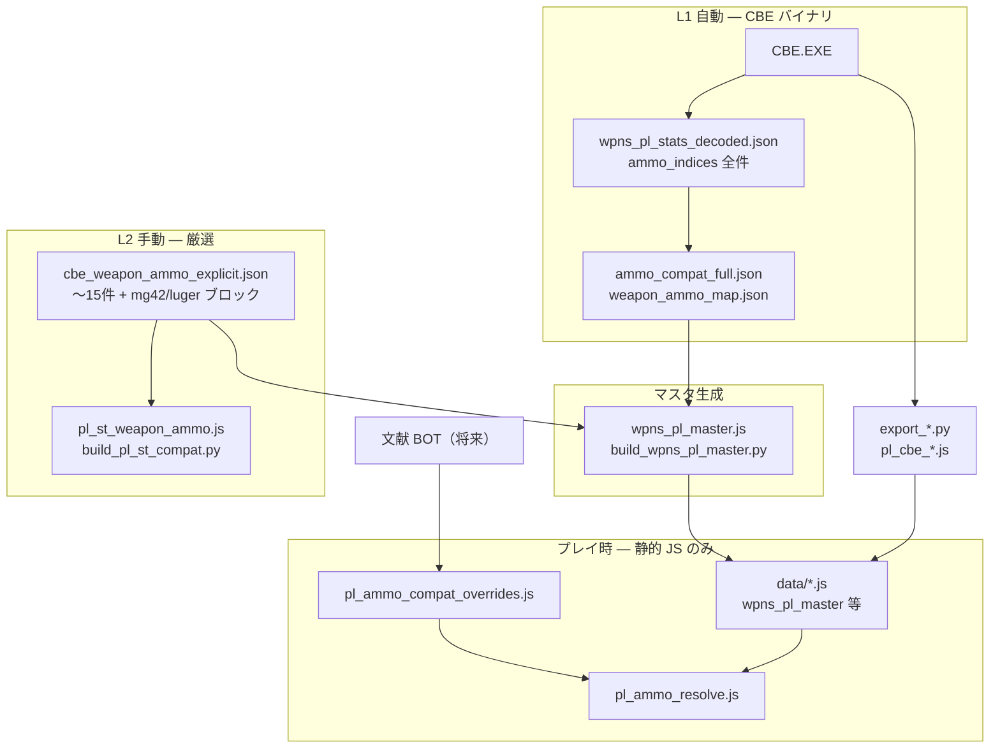

# PL/CBE データ正本パイプライン
**出自**: DESIGN_DIRECTION.md（2026-05-25）より2026-07-02に抽出。方針の最上位正本は docs/NORTH_STAR.md。

## ランタイムは静的 data のみ（重要）

**プレイ中（ブラウザでも将来 exe でも）`CBE.EXE` や `D:\PL\` は読みません。**

PL / CBE の値は **開発時に一度抽出し、`data/*.js` などに焼き込んだコピー** だけを ST が使います。  
「PL を参照している」＝「ビルド済みマスタが PL 由来の数値を保持している」という意味です。

| フェーズ | CBE.EXE / PL バイナリ | ST が触るもの |
|----------|----------------------|---------------|
| **調査** | `scripts/` が読む（`probe_*.py`, `export_*.py`） | 中間 JSON・調査メモ |
| **ビルド** | `build_wpns_pl_master.py` 等が読む | `wpns_pl_master.js`, `pl_ammo_data.js` … |
| **プレイ** | **触らない** | 上記 JS + `pl_ammo_compat_overrides.js` + `pl_ammo_resolve.js` |

### プレイ時に読み込まれる主な静的 data（例）

| ファイル | 内容 |
|----------|------|
| `data/wpns_pl_master.js` | 武器マスタ（CBE 由来値をコピー済み） |
| `data/pl_ammo_data.js` | 弾薬行 |
| `data/pl_cbe_mag_shape.js` | u27 形状フィルタ（事前エクスポート） |
| `data/pl_cbe_item_categories.js` | category 第2フィルタ |
| `data/pl_cbe_weapon_slots.js` | 付属スロット一覧 |
| `data/pl_ammo_compat_overrides.js` | 史実・再解釈（実行時の上書き） |

`index.html` から `<script src="data/...">` で順に読み込むだけです。**ゲームコードに `D:\PL` のパスは存在しません。**

### データを更新したいとき

1. 開発マシンで `D:\PL\CBE.EXE` を置く（または `PL_CBE_EXE` 環境変数）
2. 該当スクリプトを実行（例: `python scripts/export_pl_cbe_mag_shape.py`）
3. 生成された `data/*.js` をコミット or 配布物に同梱
4. ブラウザ / exe をリロード

将来 **mod フォルダ** を足す場合も、読むのは **生成済み JSON/JS** を想定。プレイヤー PC に PL 本体は不要。

### よくある誤解

| 誤解 | 実際 |
|------|------|
| プレイ中に CBE を直読みしている | **していない** — 調査ドキュメントの `D:\PL\CBE.EXE` はビルド手順の話 |
| exe 化すると CBE を mmap できる | **設計上不要** — exe の利点は配布・セーブ・ファイル API |
| `pl_ammo_resolve.js` が PL に問い合わせる | **メモリ上の静的マスタ** に対するフィルタ（u27, category, overrides）のみ |

---

## 四層構造（レイヤーの意味）

| 層 | ファイル / 生成元 | 何か | PL からの抽出？ |
|----|-------------------|------|----------------|
| **L1 生テーブル** | `wpns_pl_stats_decoded.json` ← CBE.EXE バイナリ | 全武器の `ammo_indices` スロット（4枠）。**網羅的だがノイズ多** | **自動抽出**（`cbe_build_ammo_table.py` 等） |
| **L2 厳密ペア** | `scripts/pl_decoded/cbe_weapon_ammo_explicit.json` | **検証済みの武器↔弾だけ**を手で列挙。PL の名索引（484行チェーン）の index を参照 | **抽出ではない**。PL 実プレイ + ユーザー確認 + 文献で**手書き** |
| **L3 ビルド overrides** | `data/weapon_ammo_overrides.json` | マスタ再生成時の差分 | 手動 |
| **L4 実行時 overrides** | `data/pl_ammo_compat_overrides.js` | 装填判定・ホバー表示の**ランタイム正本** | 手動（将来 BOT 提案先） |
| **形状 F1** | `pl_cbe_mag_shape.js` | u16[27] ドラム/スティック | CBE 自動 |
| **category F2** | `pl_cbe_item_categories.js` + `pl_cbe_weapon_slots.js` | cat==18 のみ主装填 / 付属スロット | CBE 自動 |

### `cbe_weapon_ammo_explicit.json` とは

**PL から機械抽出したファイルではない。**

- `_meta.source` に書いてある通り: **Platoon Leader 実プレイ** + CBE 名索引 + **ユーザー確認** の厳密ペア集
- 全 300 武器分ではなく、**最初に ST に載せた武器（m1911, bar, m1, thompson 等）だけ** edges に入っている
- 未列挙の火器は L1（バイナリ全件）か `wpns_pl_master` の `acceptsAmmo` で補う
- `build_pl_st_compat.py` が explicit → `pl_st_weapon_ammo.js`（レガシー ST 武器用）へ変換
- `build_wpns_pl_master.py` が explicit + L1 をマージして `wpns_pl_master.js` を生成

**注意**: explicit 自体も完璧ではない。例: M1A1 SMG の edge に `45ACP50T (236)` がまだ含まれている → L4 override で M1928A1 専用に補正中。

### PL 本体に override テーブルはあるか？

CBE 内を調べた限り:

- **別の「装着可否 override 専用テーブル」は未確認**
- 代わりに **(a) 武器行の ammo_indices** と **(b) 実行時ロジック（UI で選べるか）** が分離している可能性が高い
- 「テーブルに名前がある ≠ 実際に装填 UI で選べる」は PL でも起きうる（ドラム問題が典型例）

将来 BOT が突き合わせるソース: L1 生データ / explicit / L4 overrides / 文献 / **PL 実機装填テスト** / **u27 形状フラグ**（[PL_AMMO_UI_FILTER.md](./PL_AMMO_UI_FILTER.md)）。

## 重要な前提

**「弾種テーブルに名前がある」と「装着できる」は別** である。

- CBE の weapon↔ammo 行は **候補リスト** に近い（例: `45ACP50T` が M1928A1 / M1 / M1A1 すべてに行を持つ）
- PL 本体にも、名称索引と実装可能装填のズレがあり得る
- `scripts/pl_decoded/cbe_weapon_ammo_explicit.json` … **検証優先の厳密ペア**（ユーザー確認・文献ベース）
- `data/pl_ammo_compat_overrides.js` … **実行時正本**（装填判定・ホバー表示共用）
- `data/weapon_ammo_overrides.json` … ビルド時同期用

## 史実オーバーライド例: 45ACP50T

- CBE 生データ: 武器 15・16・17 にリンク
- 史実（[American Rifleman — War Drums](https://www.americanrifleman.org/content/war-drums-the-thompson-drum-magazine-in-combat)）: M1 / M1A1 はドラム用横スリット廃止 → **20/30発 box のみ**
- ゲーム方針: **M1928A1 SMG 専用**（override に `source` 引用を将来追加）

## ゴール: WW2 兵器マニア BOT

**24/365 図書館に通う BOT** が複数ソースの史実をクロールし、武器マスタへマージする。

| 段階 | 内容 |
|------|------|
| 現行 | CBE 抽出 + 手動 `*_overrides` |
| 中期 | override 行に `source` / `confidence` / `notes` を付与 |
| 目標 | 複数文献一致 → 自動マージ提案 → 人間 or 閾値で反映 |

手修正は **必ず `*_overrides` に閉じ込める**。マスタ直編集は rebuild で消える。

---

# データメンテ

- 正本: CBE パイプライン（`build_wpns_pl_master.py` 等）
- 手修正: `data/*_overrides.*` のみ
- リグレッション: 代表武器×弾の互換スナップショットテスト（将来）
- **ゴールを見失わない**: 文献 BOT によるオートチューニングが最終形
