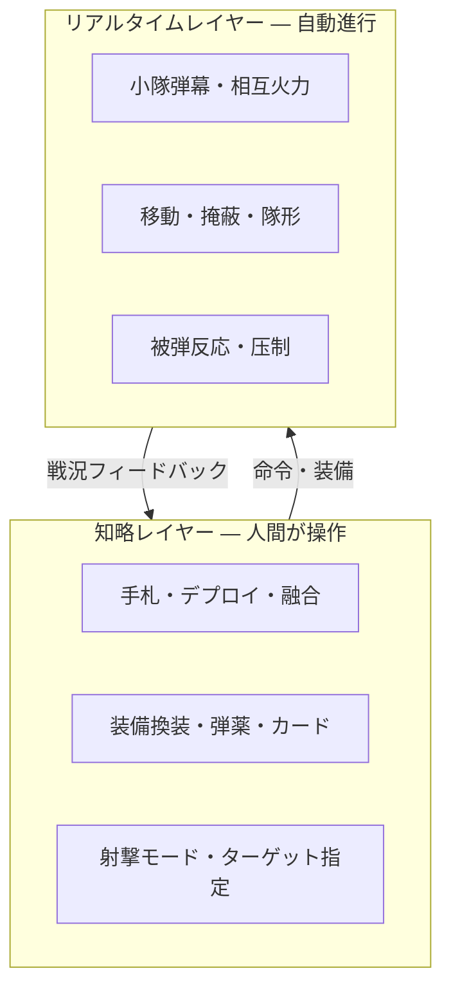

# リアルタイム戦闘 × 知略レイヤー — 設計ビジョン

**更新**: 2026-05-24  
**前提**: 現行プレイ可能ビルド（v1 地形・chaos スケール）を土台に、**新ブランチ**で試作する。

---

## 二層構造（融合の芯）

| 層 | プレイヤー体験 | 技術イメージ |
|----|--------------|--------------|
| **リアルタイム** | 兵士同士が呼応しながら弾幕を張る。止めずに流れる戦闘。 | 既存 `actionAttack` / VFX / AI の**同時進行化**。小隊単位の連射タイミング・压制。 |
| **知略** | カードで増援、装備換装、弾数指定、融合スキル。 | 既存デッキ・`swapEquipment`・サイドバー。ターン境界は「作戦フェーズ」として残す。 |

**PL から継ぐ魂**: 命令の重さ・装填互換・歩砲戦の緊張感（`phase3_pl_inheritance.md`）。  
**ST から継ぐ土台**: Phaser 戦場・chaos スケール・v1 地形。

---

## ブランチ方針（提案）

| ブランチ | 用途 |
|----------|------|
| `feature/soldier-crawl-sprite` | 現行スナップショット（v1 地形コミット済） |
| **`feat/rt-tactics-fusion`**（新規） | リアルタイム弾幕＋知略融合の試作 |
| `main` | 安定マージ先（従来どおり PR 経由） |

**Phase 0（すぐ）**: 歩兵装備フィルタ（KwK 等除外）— `pl_infantry_loadout.js`  
**Phase 1**: ターン中も味方 AI が指定ルールで射撃継続（`isAuto` 拡張）  
**Phase 2**: 小隊「弾幕」— 同一ヘックス／隣接からの連続 tracer、压制デバフ  
**Phase 3**: 作戦カードと RT の切り替え UI（ポーズ／作戦モード）

---

## GPU / パフォーマンスメモ

- 現状 GPU 70°C で安定 → chaos スケール＋弾幕 VFX は**段階導入**（軽量モード `perf/lightweight` との併用）。
- リアルタイム化で `isProcessingTurn` ロックを緩める場合、**二重射撃**・UI 競合に注意。

---

## 関連ドキュメント

- [WEAPON_ASSETS_ROADMAP.md](../WEAPON_ASSETS_ROADMAP.md) — 武器ビジュアル・PL 統一
- [BATTLE_SCALE_NOTES.md](../BATTLE_SCALE_NOTES.md) — chaos / classic
- [.cursor/plans/phase3_pl_inheritance.md](../.cursor/plans/phase3_pl_inheritance.md) — 装填互換ゲート
