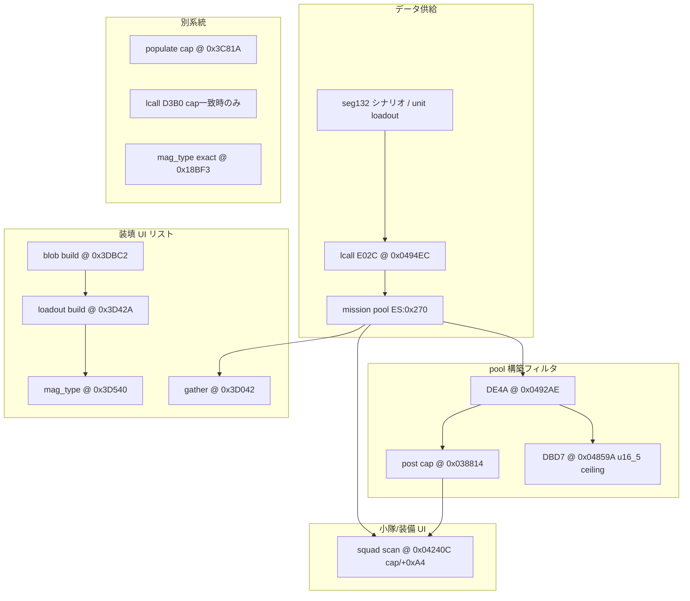

# Panzer Leader CBE.EXE — RE 引き継ぎ索引

**目的**: `D:\PL\CBE.EXE` の装填/装備ロジックを RE し、確定分だけ `squad_tactics` に段階フィルタとして移植する。  
**本書**: 他 AI / 将来の自分向け **入口ドキュメント** — 詳細はリンク先、ここでは構造と状態だけ。

**最終更新**: 2026-06-01

---

## 0. Antigravity / 他 AI への引き継ぎ

**→ [PL_RE_HANDOFF_ANTIGRAVITY.md](./PL_RE_HANDOFF_ANTIGRAVITY.md)**（9router 設定・直近 RE・次タスク・コピペプロンプト）

---

## 1. 読む順序（新規参加者向け）

1. **本書** — 全体パイプラインと doc 一覧
2. Antigravity 移行時 → **[PL_RE_HANDOFF_ANTIGRAVITY.md](./PL_RE_HANDOFF_ANTIGRAVITY.md)** を先に
3. [PL_CBE_AMMO_FILTER_RE.md](./PL_CBE_AMMO_FILTER_RE.md) — フィルタ段の ST 仮説 vs RE 確定
4. [PL_CBE_273_272_PATH_RE.md](./PL_CBE_273_272_PATH_RE.md) — 代表事例（Kar98k 272/273）の end-to-end
5. 担当タスクに応じて下表の個別 RE doc

---

## 2. 装填パイプライン（確定度順）



**Kar98k 273→272 の正本**: mission pool に **272/273 両方** → cap/+0xA4 で 273 落ち。**3D42A / D3B0 は差替本体ではない**。

---

## 3. RE ドキュメント一覧

| Doc | トピック | 状態 |
|-----|----------|------|
| [PL_CBE_RE_INDEX.md](./PL_CBE_RE_INDEX.md) | **本索引** | 運用中 |
| [PL_CBE_AMMO_FILTER_RE.md](./PL_CBE_AMMO_FILTER_RE.md) | 全フィルタ段 + ST 仮説 | 混合 |
| [PL_CBE_273_272_PATH_RE.md](./PL_CBE_273_272_PATH_RE.md) | 273→272 実経路 | **CONFIRMED** |
| [PL_CBE_MISSION_POOL_RE.md](./PL_CBE_MISSION_POOL_RE.md) | pool ES:0x270 / DE4A / seg132 | 部分 |
| [PL_CBE_DE_SLOT_RE.md](./PL_CBE_DE_SLOT_RE.md) | DE85/DE9A/DE5E slot 分岐 | **CONFIRMED** |
| [PL_CBE_DBD7_RE.md](./PL_CBE_DBD7_RE.md) | DBD7 u16_5 天井 | **CONFIRMED** |
| [PL_CBE_MAG_TYPE_3D540_RE.md](./PL_CBE_MAG_TYPE_3D540_RE.md) | loadout mag_type ゲート | **CONFIRMED** |
| [PL_CBE_3DBC2_RE.md](./PL_CBE_3DBC2_RE.md) | descriptor blob 構築 | 部分 |
| [PL_CBE_LOADOUT_TEMPLATE_RE.md](./PL_CBE_LOADOUT_TEMPLATE_RE.md) | seg132 テンプレ dump | **CONFIRMED**（Kar98k） |
| [PL_CBE_800F_MASK_RE.md](./PL_CBE_800F_MASK_RE.md) | 0x800F mask @ 3D540 解決 | **CONFIRMED**（静的） |
| [PL_CBE_SEG132_EXPORT.md](./PL_CBE_SEG132_EXPORT.md) | seg132 全 descriptor JSON | **CONFIRMED** |
| [PL_CBE_PASS2_1EC_RE.md](./PL_CBE_PASS2_1EC_RE.md) | pass2 @ 0x1EC / 3D59C | **CONFIRMED**（静的） |
| [PL_CBE_LOADOUT_CANDIDATE_RE.md](./PL_CBE_LOADOUT_CANDIDATE_RE.md) | 候補列 / 3D042 | **CONFIRMED** |
| [PL_CBE_CAP_SUBSTITUTE_RE.md](./PL_CBE_CAP_SUBSTITUTE_RE.md) | build_ui_ammo_list cap | **CONFIRMED** |
| [PL_CBE_D3B0_SUBSTITUTE_RE.md](./PL_CBE_D3B0_SUBSTITUTE_RE.md) | lcall D3B0（cap一致時） | **CONFIRMED** |
| [PL_CBE_AMMO_UI_MATCH_RE.md](./PL_CBE_AMMO_UI_MATCH_RE.md) | lcall 9858/9698 UI マッチ | **CONFIRMED** |
| [PL_CBE_AMMO_UI_LOADLIST_RE.md](./PL_CBE_AMMO_UI_LOADLIST_RE.md) | 0x1805A UI slot | **CONFIRMED** |
| [PL_CBE_F7C8_DEEP_RE.md](./PL_CBE_F7C8_DEEP_RE.md) | F7C8 / populate 経路 | **CONFIRMED** |
| [PL_CBE_EQUIP_CHAIN_RE.md](./PL_CBE_EQUIP_CHAIN_RE.md) | 装備チェーン 46C00 | 部分 |
| [PL_CBE_POOL_CBE_RE.md](./PL_CBE_POOL_CBE_RE.md) | 名称=cbe index | **CONFIRMED** |
| [PL_CBE_UI_TABLE_RE.md](./PL_CBE_UI_TABLE_RE.md) | UI テーブル +0x48 | 部分 |
| [PL_CBE_VALIDATE_422B8_RE.md](./PL_CBE_VALIDATE_422B8_RE.md) | validate 422B8 | 部分 |
| [PL_CBE_AUX_UI_RE.md](./PL_CBE_AUX_UI_RE.md) | 副装備 UI | 部分 |

各 doc の末尾に **ST 再現指針 / 未完了 / 関連** がある — 個別 doc を更新するときはこの三要素を維持すること。

---

## 4. RE スクリプト ↔ 再生成

正本バイナリ: **`D:\PL\CBE.EXE`**  
CBE 64B テーブル: file **`0x1DDF00`**, stride 64

| スクリプト | 出力 doc | JSON |
|------------|----------|------|
| `re_cbe_273_272_path.py` | PL_CBE_273_272_PATH_RE.md | pl_decoded/cbe_273_272_path_re.json |
| `re_cbe_mission_pool.py` | PL_CBE_MISSION_POOL_RE.md | pl_decoded/cbe_mission_pool_re.json |
| `re_cbe_dbd7_deep.py` | PL_CBE_DBD7_RE.md | pl_decoded/cbe_dbd7_re.json |
| `re_cbe_mag_type_3d540.py` | PL_CBE_MAG_TYPE_3D540_RE.md | pl_decoded/cbe_mag_type_3d540_re.json |
| `re_cbe_3dbc2.py` | PL_CBE_3DBC2_RE.md | pl_decoded/cbe_3dbc2_re.json |
| `re_cbe_loadout_template.py` | PL_CBE_LOADOUT_TEMPLATE_RE.md | pl_decoded/cbe_loadout_template_re.json |
| `re_cbe_800f_mask.py` | PL_CBE_800F_MASK_RE.md | pl_decoded/cbe_800f_mask_re.json |
| `re_cbe_seg132_export.py` | PL_CBE_SEG132_EXPORT.md | pl_decoded/cbe_seg132_units.json |
| `export_pl_cbe_mission_pool.py` | [PL_CBE_RUNTIME_POOL_DUMP.md](./PL_CBE_RUNTIME_POOL_DUMP.md) | data/pl_cbe_mission_pool.json |
| `re_cbe_pass2_1ec.py` | PL_CBE_PASS2_1EC_RE.md | pl_decoded/cbe_pass2_1ec_re.json |
| `re_cbe_loadout_candidate.py` | PL_CBE_LOADOUT_CANDIDATE_RE.md | pl_decoded/cbe_loadout_candidate_re.json |
| `re_cbe_d3b0_resolve.py` | PL_CBE_D3B0_SUBSTITUTE_RE.md | pl_decoded/cbe_d3b0_substitute_re.json |
| `re_cbe_lcall_fixup_resolve.py` | PL_CBE_AMMO_UI_MATCH_RE.md | pl_decoded/cbe_ammo_ui_match_re.json |
| `re_cbe_de_slot_deep.py` | PL_CBE_DE_SLOT_RE.md | pl_decoded/cbe_de_slot_re.json |
| `re_cbe_ammo_filter_disasm.py` | PL_CBE_AMMO_FILTER_RE.md | — |

一括再生成（主要）:

```bash
python scripts/re_cbe_273_272_path.py
python scripts/re_cbe_mission_pool.py
python scripts/re_cbe_dbd7_deep.py
python scripts/re_cbe_mag_type_3d540.py
python scripts/re_cbe_3dbc2.py
python scripts/re_cbe_loadout_template.py
python scripts/re_cbe_800f_mask.py
python scripts/re_cbe_seg132_export.py
python scripts/re_cbe_pass2_1ec.py
python scripts/re_cbe_loadout_candidate.py
```

---

## 5. 技術的注意（ハマりどころ）

| 項目 | 正 | 誤例 |
|------|-----|------|
| **file offset** | **`0x04xxxx` 6 桁**（例 `0x042475`） | `0x424475`（7 桁→ファイル外） |
| **lcall オペランド** | 生バイト `9A ip_lo ip_hi cs_lo cs_hi` — Capstone 表示順が **逆** のことがある | 表示通りに seg+off 解釈 |
| **E02C 着地** | caller NE seg + **IP imm**（例 `0xE02C`→`0x0494EC`） | — |
| **DBD7 着地** | seg5 + **`0xD0DA`**→`0x04859A`（≠`0x049097`） | seg word `0xDBD7` を off と混同 |
| **+0x28** | CBE 静的=**mag_cap** / ランタイム武器=**roster_slot** | 文脈無しで cap 照合と決めつけ |

---

## 6. CBE レコード主要オフセット

| Off | u16 idx | 武器例 | 弾例 | 用途 |
|-----|---------|--------|------|------|
| +0x28 | [20] | mag_cap=5 | cap | populate / pool cap フィルタ |
| +0x2A | [21] | w21=0 / sub_action | a21 mag_type | 18BF3 / **3D540** |
| +0x36 | [27] | u27 | u27 | ST 形状クラスタ（データ仮説） |
| +0x0A | [5] | u16_5=3 | u16_5=0 | **DBD7** 天井 |

ランタイムのみ: **+0xBA**（リンク済みカウンタ @ 3D540）, **+0xA4**（cap 不一致フラグ）

---

## 7. ST 実装（暫定）との対応

| CBE 段 | ST ファイル | フラグ/関数 |
|--------|-------------|-------------|
| u27 形状 | pl_cbe_mag_shape.js | u27 フィルタ |
| mag_cap | pl_ammo_cbe_filters.py, pl_ammo_resolve.js | FEATURE_PL_MAG_CAP_FILTER |
| mag_type exact | pl_cbe_mag_type.js | 未配線（w21=0 多数） |
| mission pool+cap | applyMagCapSubstitute | 273→272 圧縮 |
| descriptor blob | **未実装** | seg132 JSON から段階移植可 — [PL_CBE_SEG132_EXPORT.md](./PL_CBE_SEG132_EXPORT.md) |
| mag_type masked gate | pl_cbe_mag_type.js | `(mag&0x800F)==(hdr&0x800F)` — [PL_CBE_800F_MASK_RE.md](./PL_CBE_800F_MASK_RE.md) |

---

## 8. 未完了（優先順）

1. ~~**DS:0x13BD 武器テンプレ table**~~ → seg132 dump [PL_CBE_LOADOUT_TEMPLATE_RE.md](./PL_CBE_LOADOUT_TEMPLATE_RE.md)；**runtime DS マップ** 未了
2. ~~**0x800F mask vs mag_type**~~ → [PL_CBE_800F_MASK_RE.md](./PL_CBE_800F_MASK_RE.md)
3. ~~**pass2 @ 0x1EC**~~ → [PL_CBE_PASS2_1EC_RE.md](./PL_CBE_PASS2_1EC_RE.md)；runtime 列 dump 未了
4. ~~**DE85 / DE9A / DE5E** — DE4A slot 分岐 — [PL_CBE_DE_SLOT_RE.md](./PL_CBE_DE_SLOT_RE.md)~~ (再配置チェーン解決)
5. ~~**`lcall D0F0`** — DBD7 被除数ソース~~ (MSVC LCG rand() 乱数確率天井判定と確定)
6. **`0x771E`** cat18 — 静的 caller 0（低優先）
7. runtime **`0x70B2`/`0xB979`** → seg132 完全マップ
8. E02C(0x1EC) vs E02C(0x270) 入力 ptr 同一性（DOSBox）

---

## 9. doc 更新ルール（引き継ぎ用）

新しい RE を確定したら:

1. **`scripts/re_cbe_*.py`** を追加/更新 → md + json 自動生成
2. **個別 `PL_CBE_*_RE.md`** に結論・ST 再現・未完了・関連
3. **本 INDEX** の表 3 と表 4 に 1 行追加
4. 状態ラベル: **CONFIRMED** / **部分** / **HYPOTHESIS** / **UNREACHABLE**

---

## 10. 他 AI への引き継ぎチェックリスト

0. **Antigravity 移行**: [PL_RE_HANDOFF_ANTIGRAVITY.md](./PL_RE_HANDOFF_ANTIGRAVITY.md)（9router + 直近 DE slot RE）
1. **入口**: 本書 [PL_CBE_RE_INDEX.md](./PL_CBE_RE_INDEX.md) §2 パイプライン図を読む
2. **代表事例**: [PL_CBE_273_272_PATH_RE.md](./PL_CBE_273_272_PATH_RE.md)（273→272 は pool+cap が正本）
3. **再生成**: §4 の `python scripts/re_cbe_*.py` で md/json を更新（`D:\PL\CBE.EXE` 必須）
4. **罠**: §5（file offset 6桁、lcall バイト順、DBD7=0x04859A）
5. **新規 RE 追加時**: スクリプト + `PL_CBE_*_RE.md` + 本 INDEX §3/§4/§8 を更新
6. **JSON 機械可読**: `scripts/pl_decoded/cbe_*_re.json` — 詳細 asm は JSON、結論は md

## 11. 関連（ST 側）

- [PL_AMMO_TRUTH.md](./PL_AMMO_TRUTH.md) — ST データ正本方針
- [DESIGN_DIRECTION.md](./DESIGN_DIRECTION.md) — overrides とマスタ生成
- [PL_MAG_TYPE_FILTER.md](./PL_MAG_TYPE_FILTER.md) — mag_type データ RE
