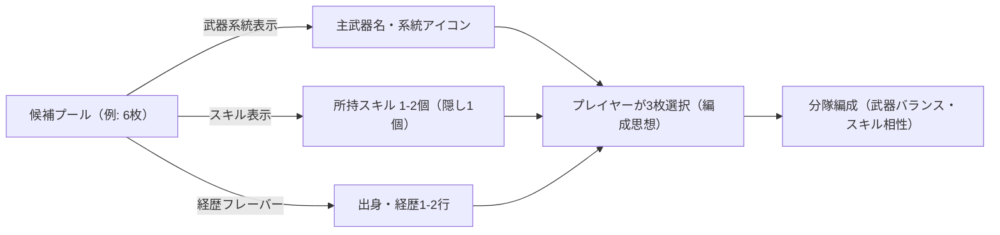
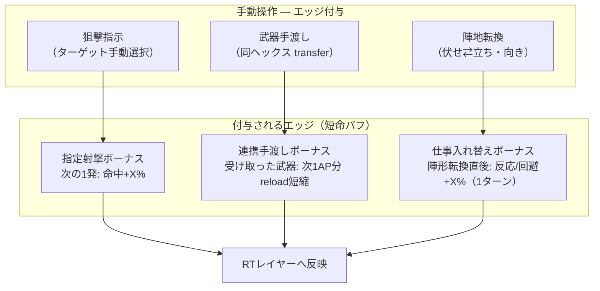
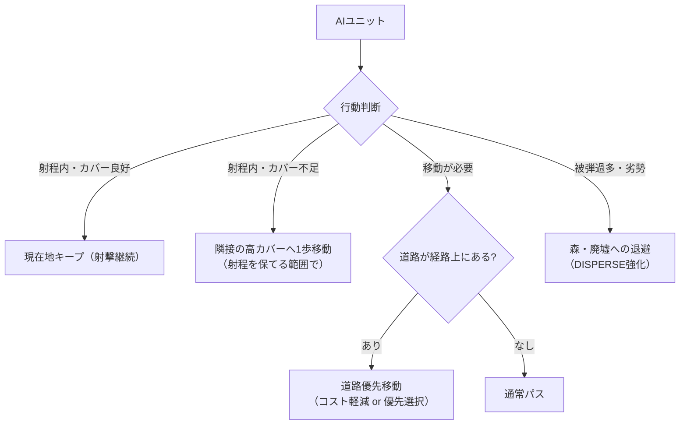
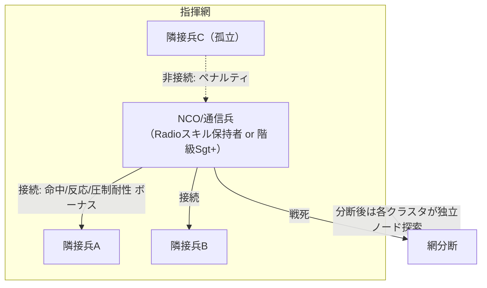
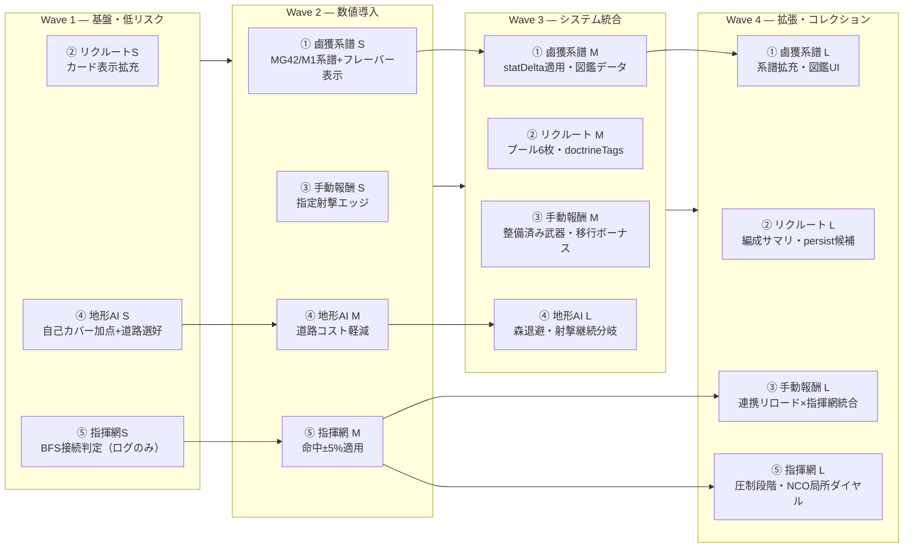

# コアシステム再設計 — 鹵獲系譜・リクルート・手動報酬・地形AI・指揮網

**更新**: 2026-06-12
**目的**: 5つのコアシステム（鹵獲改造系譜 / リクルート / 手動プレイ報酬 / 地形AI / Battle Cloud=指揮網）を、`docs/DESIGN_DIRECTION.md` と `docs/GAMEPLAY_RT_TACTICS_VISION.md` のビジョンに沿って再設計する。**ローグライク的パワーインフレを避け、ルール＝楽しい制約**を軸に、既存実装（融合・戦雲・AI・地形）の上に積む。

**関連ドキュメント**

| ドキュメント | 内容 |
|-------------|------|
| [DESIGN_DIRECTION.md](./DESIGN_DIRECTION.md) | 知略ダイヤル・NCO・手動/AUTO哲学（正本） |
| [GAMEPLAY_RT_TACTICS_VISION.md](./GAMEPLAY_RT_TACTICS_VISION.md) | RT × 知略二層 |
| [ARCHITECTURE.md](../ARCHITECTURE.md) | 起動フロー・ファイル責務 |
| [BATTLE_SCALE_NOTES.md](../BATTLE_SCALE_NOTES.md) | classic/chaos プリセット |

---

## 0. 現状実装の要約（前提）

### 0.1 融合（fusion）システム — 現状

`phaser_bridge.js` の `Card` / `UIScene`:

- 手札カード同士（同じ `cardType`、`FUSABLE_UNIT_TYPES` に含まれる歩兵・戦車）をドラッグ&ドロップすると `fuseCards()` が発火
- `generateFusionData()` がランダムに **スキル1〜3個・HPブースト5〜15%・AP+1（15%）** を生成 — 完全ランダムで装備とは無関係
- `fusionCount` が増えるごとに HP/AP ボーナスが `Math.pow(2, count-1)` で**指数的に強化**（`logic_campaign.js` `createSoldier`）
- 見た目は虹色オーラ（`auraGraphics`）・グロー（`fusionGlowFx`）・「Rainbow Weapon」ダメージボーナス（武器に `isRainbow: true` + `rainbowDmgBonus`）
- 戦車の場合 `fusionCount >= 2` で 40% の確率で `m8_rocket`（カリオペ風ロケット）を獲得

**問題点**:
- 完全にランダム・装備や系譜と無関係 → 「鹵獲改造品」というフレーバーが無い
- `Math.pow(2, count-1)` の指数スケールはパワーインフレの典型（オーナーが避けたいローグライク的成長曲線）
- コレクション性（図鑑・系譜の発見）が無く、見た目（オーラ）のみの差別化

### 0.2 リクルート画面 — 現状

`logic_campaign.js` `initSetupScreen()`:

- 固定4種（`rifleman`, `scout`, `gunner`, `mortar_gunner`）のカードを表示、**3枚選択で開始**
- 各カードには名前・ポートレート・能力値レーダーのみ表示。**武器名・スキル・経歴は出ない**
- 選択順・組み合わせは戦闘ロジックに一切影響しない（`createSoldier` のテンプレートに紐づくだけ）
- `±1` のランダムばらつきが `params` に入る程度

**問題点**:
- 候補4種・採用3種で「選ばない」選択肢が実質1つしかない（ドラフト感ゼロ）
- 表示情報が能力値レーダーのみで、武器・スキル・フレーバーが見えない → 「分隊編成思想」を選べない

### 0.3 手動プレイの報酬 — 現状

`docs/DESIGN_DIRECTION.md` の「株式取引」哲学:
> AUTO=相場に乗る（不利寄り）、手動=エッジを取る

実装面:
- `FEATURE_SAME_HEX_TRANSFER`（Phase A）で同ヘックス装備渡しは実装済み
- だが渡した後の **明確な戦術的見返り**（命中率・连射・压制への寄与）が薄く、AUTOでも似た結果になりやすい
- 狙撃指示（ターゲット指定）・陣地転換（伏せ/立ち）はあるが、手動操作でのみ得られる**数値的エッジ**が体系化されていない

### 0.4 地形とAI — 現状

`logic_ai.js`:
- `pickStrategicTarget()` は**ターゲット側のカバー**だけ評価（`score += Math.max(0, 28 - cover)` — 露出した敵を優先攻撃）
- `pickMoveStep()` は `BattleCloudTactics.pickCloudMoveStep`（クラスタ数 ≥4 のときのみ）→ それ以外は `findPath` で**最短経路のみ**
- `BattleCloudTactics.scoreMoveHex()` の `DISPERSE` ポスチャでのみ `cover * 0.55` を加点 — **自分の移動先カバーを評価するのは劣勢時のみ**
- 道路 (`TERRAIN.ROAD`, `cost: 1, cover: 35`) は **`cost` が他の地形と同じ1** なので、`getTerrainMoveCost()`（`Math.ceil(base * mult)`）では**移動ボーナスが事実上ゼロ**。`roadStepCost()` の cost 0.25 は**マップ生成時の道路敷設専用**で、ユニット移動には使われていない
- 森 (`FOREST`, `cost: 2, cover: 25`) は移動コストが高いため、`HOLD_CLOUD`/`ADVANCE_*` ポスチャでは `terrainCost * 2.5` のペナルティでむしろ避けられる傾向

**問題点**:
- 自軍が不利でない限り、AIは自分のいる地形のカバーを考慮しない（露出地形に居座る）
- 道路は「視覚的に道」だが移動面での優位性が無い
- 森への退避は `DISPERSE`（HP半減や数的不利時）のみで、通常時に「森を背にする」ような防御的ポジショニングは無い

### 0.5 Battle Cloud — 現状

`battle_cloud.js` / `battle_cloud_tactics.js` / `phaser_battle_cloud.js`:
- 同一/隣接ヘックスに**4人以上**集まると「戦雲クラスタ」が形成され、形状（compact/elongated/stack）に応じて被ダメ軽減（最大52%）
- 敵戦雲に侵入した自軍は被ダメ増加・与ダメ減少（intruder pressure）
- 視覚効果（外周の波打つグロー線・火花・1ヘックス隙間の「糸」）が中心— **誰がノードかという情報は持たない**
- `BattleCloudTactics` はクラスタの形状に応じた移動先評価のみ（`HOLD_CLOUD`/`ADVANCE_*`/`DISPERSE`/`BRIDGE`）

**問題点**:
- 「指揮系統」としての意味付けが無い。通信兵・士官の有無に関わらず同じ計算
- `DESIGN_DIRECTION.md` の NCO ビジョン（局所ダイヤル・忠誠/練度・離脱ペナルティ）と接続されていない

---

## 1. 鹵獲改造系譜システム

### 1.1 現状の問題

- 融合＝ランダムスキル＋HP/AP指数増加。装備とも世界観とも無関係
- `Math.pow(2, count-1)` のHP/APブーストはパワーインフレ（4融合で+8倍域のHP補正）
- 見た目（虹オーラ）だけが「特別感」を担っており、収集・発見の喜びがない

### 1.2 設計方針

**「融合」→「鹵獲改造（鹵獲アップグレード）」へリブランド**。プレイヤーが同種ユニット/武器カードを重ねる操作は変えず、結果を**架空兵器廠の改修モデル**として扱う。

- 性能は**インフレさせない**。base武器の `dmg` 総量・`rng` は概ね維持し、**特性トレードオフ**（連射↑/過熱、命中↑/重量↑、装弾数↑/再装填遅延↑等）で横展開
- 各鹵獲モデルは **実在武器 → 鹵獲呼称 → 架空後継** の3段階系譜を持つ
  - 例: `MG42`（実在, WPNS/wpns_pl_master） → `MG42(r)`（鹵獲・米軍簡易改修） → `MG45/V`（極秘試作） → `MG441`（"20年戦争"世界線の制式採用モデル）
- 各モデルに **1〜2行のフレーバーテキスト**（架空兵器廠名・極秘開発経緯・20年戦争世界線への接続）
- **鹵獲図鑑（Capture Codex）**: 発見した系譜モデルを記録するコレクション要素。プレイ中の融合結果がランダムではなく「未発見モデルを優先的に提示」する設計で収集欲を刺激

### 1.3 系譜データ構造案

新規ファイル `data/wpns_capture_lineage.js`（既存 `WPNS` / `wpns_pl_master` の `acceptsAmmo`/`plCategory` 等は変更しない。**追加マスタ**として読み込む）。

```javascript
/** 鹵獲改造系譜マスタ。各ラインは実在武器コードから始まり、鹵獲改修→架空後継へ続く。 */
const CAPTURE_LINEAGES = {
  // MG42 → 鹵獲改修 → 極秘試作 → 制式採用（20年戦争世界線）
  mg42_line: {
    baseCode: 'pl_402',           // 実在 MG42 (wpns_pl_master)
    name: 'MG42 系譜',
    stages: [
      {
        code: 'mg42r',
        name: 'MG42(r)',
        tier: 1,
        flavor: [
          '鹵獲品に米軍が応急の三脚・冷却フィンを追加した簡易改修型。',
          '過熱対策はその場しのぎだが、連射速度はそのまま活かされている。'
        ],
        // 性能はトレードオフ（横展開）。dmg等の総量は base からほぼ不変。
        statDelta: { burst: +2, overheatRate: +0.15, acc: -3 },
        unlockHint: '鹵獲MG42を3回戦闘で運用すると判明'
      },
      {
        code: 'mg45v',
        name: 'MG45/V',
        tier: 2,
        flavor: [
          '「ヴェルケ・アインホルン」極秘兵器廠が鹵獲データを基に再設計した試作型。',
          'ローラーロッキングを再チューニングし連射は向上、銃身交換の頻度が増した。'
        ],
        statDelta: { burst: +4, overheatRate: +0.30, rld: +1, wgt: -1 },
        unlockHint: 'MG42(r) を装備した兵が生存したまま次セクタへ'
      },
      {
        code: 'mg441',
        name: 'MG441',
        tier: 3,
        flavor: [
          '20年戦争期、複数勢力で准制式採用された後継機関銃。',
          '現代寄りの公差管理によって信頼性は向上したが、専用ベルトリンクが必要。'
        ],
        statDelta: { burst: +6, acc: +4, overheatRate: +0.45, mag: -10, ammoFamily: 'mg441_belt' },
        unlockHint: 'MG45/V 装備兵が鹵獲図鑑の他3系譜を解放済み'
      }
    ]
  },

  // M1 Garand → 鹵獲改修（独軍が運用）→ 架空後継
  m1_line: {
    baseCode: 'm1',
    name: 'M1 Garand 系譜',
    stages: [
      {
        code: 'm1_g',
        name: 'M1(g)',
        tier: 1,
        flavor: [
          '独軍が鹵獲したM1に独製照準器を移植した個体。',
          'クリップ送弾はそのままだが照準精度が向上している。'
        ],
        statDelta: { acc: +5, rld: +1 }
      },
      {
        code: 'stg_v',
        name: 'StG-V "Garand-Muster"',
        tier: 2,
        flavor: [
          '「アインホルン」廠が八発クリップ機構を捨て、独自20連箱型弾倉に置き換えた試作。',
          '装弾数は増えたが、近接戦での取り回しはやや悪化。'
        ],
        statDelta: { cap: +12, mag: -1, wgt: +2, acc_drop: +1 }
      }
    ]
  }

  // ... 他系譜（Thompson系, BAR系, K98系 等）は同様のパターンで追加
};

if (typeof window !== 'undefined') window.CAPTURE_LINEAGES = CAPTURE_LINEAGES;
```

### 1.4 「特性の変化」による横展開（インフレ防止の核）

| 軸 | トレードオフ例 |
|----|----------------|
| 連射 ↑ | `burst` 増加 ⇄ `overheatRate`（新規概念: 連続射撃で `acc` 一時低下 or `jam` 率上昇） |
| 命中 ↑ | `acc` 増加 ⇄ `wgt`（重量）増加・移動コスト増 |
| 装弾数 ↑ | `cap`/`mag` 増加 ⇄ `rld`（再装填ターン）増加・専用弾薬ファミリー化 |
| 軽量化 | `wgt` 減少 ⇄ `dmg` または `acc_drop`（命中減衰）の悪化 |
| 照準精度 | `acc_drop` 改善 ⇄ `overRangePenalty` 悪化 |

**ルール**: 各ステージの `statDelta` は「合計で見ると概ねゼロサム」になるよう数値レビュー（例: `acc +5` なら `wgt +1.5` 相当、`burst +4` なら `overheatRate +0.3` 相当）。`dmg` 自体は変更しない（ダメージインフレを直接防ぐ）。

### 1.5 鹵獲図鑑（Capture Codex）

```javascript
// セーブデータ（campaign 内）に持たせる発見記録
campaign.captureCodex = {
  discovered: ['mg42r', 'mg45v'],     // 発見済みステージcode
  equippedHistory: { 'mg441': { firstSeenSector: 7, soldierName: 'Walter Reed' } }
};
```

- 図鑑UI（サイドバー or リワード画面に追加パネル）: 系譜をツリー表示し、未発見はシルエット＋「???」
- 融合（鹵獲改修）が発生する際、**未発見ステージを優先的に候補に含める**（確率重み付け、完全ランダムではない）
- フレーバーテキストは図鑑内でのみ全文表示。戦場ホバーには1行サマリ

### 1.6 既存融合システムとの接続

- `generateFusionData()` を `generateCaptureUpgrade(weaponCode, lineageProgress)` に置き換え（旧名は `@deprecated` ラッパーとして残す）
- `fusionCount` → `captureTier`（1〜3）にリネーム（UI文言のみ先行変更も可）。**HP/APの指数ブーストは撤廃**し、代わりに装備の `statDelta` を `createItem()` で適用
- 戦車の `m8_rocket` 付与（40%ランダム）は「鹵獲改修」ロジックから分離し、別途「特殊鹵獲車両イベント」として整理（系譜と無関係な一発ネタは混在させない）
- 視覚（虹オーラ・グロー）は「鹵獲改修済み」のバッジ表現として継続利用可（過度な演出は抑制 — `QUALITY_DIRECTIVE_2026-06.md` のSF15%方針に整合）

### 1.7 実装フェーズ

| フェーズ | 規模 | 内容 |
|---------|------|------|
| **S** | 小 | `data/wpns_capture_lineage.js` 新規（MG42系・M1系の2系譜のみ）。フレーバーテキストをホバーに表示する読み取り専用UI |
| **M** | 中 | `generateCaptureUpgrade()` 実装、`statDelta` 適用ロジック（`createItem`/`createSoldier` 統合）、HP/AP指数ブースト撤廃、鹵獲図鑑データ構造＋簡易UI（リスト表示のみ） |
| **L** | 大 | 系譜を主要武器ファミリー（Thompson/BAR/K98/Luger/M1911等）に拡充、図鑑のツリーUI＋発見演出、鹵獲改修の確率重み付け（未発見優先）、20年戦争世界線のセクタ進行と連動したアンロック演出 |

### 1.8 リスク

- **データ整合性**: `statDelta` が `acceptsAmmo`/`plCompat`（PL由来弾薬互換）と矛盾しないよう、新規 `ammoFamily` を増やす場合は `pl_ammo_compat_overrides.js` 側との整合チェックが必要
- **既存セーブ/演出依存**: `fusionCount`・`isRainbow` を直接参照しているコード（`phaser_bridge.js` の Card 描画、`logic_campaign.js` の `createSoldier`）の置き換え漏れ
- **バランス**: 「ゼロサム」の検証が手作業になりやすい — WS-3（ゲームバランス）的なレビューフェーズを別途確保

---

## 2. リクルート画面の戦略化

### 2.1 現状の問題

- 候補4種・採用3種で実質「外す1枚を選ぶだけ」
- 武器・スキル・経歴が見えないため「分隊編成思想」を選ぶ情報がない
- 選択が勝敗・プレイ感に影響しない（テンプレートの能力値レーダーのみ）

### 2.2 設計方針

**ドラフト制**: 候補プール数 > 採用枠数 にし、**武器系統・スキル傾向・経歴フレーバー**を開示した上で選ぶ。「狙撃寄り」「近接火力寄り」「支援重視」など**編成思想**が選択に直結するようにする。



### 2.3 表示情報の拡充

| 項目 | 現状 | 拡充後 |
|------|------|--------|
| 名前・ポートレート | あり | 維持 |
| 能力値レーダー | あり | 維持 |
| **主武器名** | 一部表示済み（`mainWeaponName`） | 系統アイコン＋カテゴリ（`plCategory`: rifle/smg/mg/sniper等）を明示 |
| **スキル** | 非表示 | 1〜2個を開示、+1個は「???」（配備後に判明＝発見の楽しみ維持） |
| **出身・経歴フレーバー** | 非表示 | 1〜2行のランダム生成テキスト（出身州・部隊歴・口癖など） |
| **編成適性タグ** | 非表示 | 「火力支援」「索敵」「近接」等、既存の `role`/`stats` から導出したバッジ |

### 2.4 ドラフト制データ構造案

```javascript
// logic_campaign.js 拡張イメージ
const RECRUIT_POOL_SIZE = 6;   // 候補プール数
const RECRUIT_PICK_COUNT = 3;  // 採用枠数（既存と同じ3を維持）

/** 1候補のプレビュー情報 */
function buildRecruitCandidate(templateKey, portraitIndex) {
  const t = UNIT_TEMPLATES[templateKey];
  const params = campaign.getPreviewParams(t);
  const mainWeaponCode = t.main; // 将来: PL武器プールからの抽選にも対応
  const weaponMaster = WPNS[mainWeaponCode] || {};
  return {
    key: templateKey,
    name: generateSoldierName(),
    portraitIndex,
    params,
    weapon: {
      code: mainWeaponCode,
      name: weaponMaster.name,
      category: weaponMaster.plCategory || 'unknown'
    },
    revealedSkills: pickRandomSkills(2),      // 表示するスキル
    hiddenSkillCount: 1,                       // 配備後に判明
    background: generateBackgroundFlavor(),    // 出身・経歴フレーバー
    doctrineTags: deriveDoctrineTags(t, params) // 例: ['火力支援','索敵']
  };
}
```

### 2.5 ドラフトUIフロー

1. `RECRUIT_POOL_SIZE`（例: 6）枚を生成・表示
2. プレイヤーが `RECRUIT_PICK_COUNT`（3）枚を選択
3. 選ばなかった候補は**次セクタ以降の増援候補プールに一部persist**（「惜しいが見送った人材が後で再登場」する含み — 将来拡張、Lフェーズ）
4. 選択時に「編成サマリ」（武器系統の重複・doctrineTags の傾向）をリアルタイム表示し、**バランスの偏り**（例: 近接3名 = 遠距離火力ゼロ）を視覚的に警告

### 2.6 実装フェーズ

| フェーズ | 規模 | 内容 |
|---------|------|------|
| **S** | 小 | カード表示の拡充のみ（武器系統アイコン＋経歴フレーバー1行を既存4枚に追加。選択ロジックは変更なし） |
| **M** | 中 | 候補プールを6枚に拡張（`RECRUIT_POOL_SIZE`）、スキル1〜2個の事前開示、`doctrineTags` 導出と表示 |
| **L** | 大 | 編成サマリ（重複・偏り警告）UI、見送った候補の増援プールpersist、初期テンプレート以外（PL武器プール由来の主武器バリエーション）を候補に含める |

### 2.7 リスク

- **学習曲線**: `DESIGN_DIRECTION.md` の「学習曲線・チュートリアル」方針（初回1-2戦は固定編成）と矛盾しないよう、**チュートリアル中はドラフトをスキップ/簡略化**するフラグが必要
- **情報過多**: カードサイズ制約の中で武器・スキル・経歴をどう収めるか — レイアウト再設計が伴う（既存 `card-img-box`/`card-radar-box` の再配置）
- **既存 `AVAILABLE_CARDS`/増援カードとの整合**: リクルート画面（初期3名）と戦闘中の増援カード（`AVAILABLE_CARDS`）は別系統 — ドラフト要素を増援にも広げるかは要検討

---

## 3. 手動プレイの報酬設計

### 3.1 現状の問題

- AUTOでも「だいたい同じ結果」になりやすく、手動操作（狙撃指示・武器手渡し・陣地転換）の**数値的エッジ**が不明瞭
- `FEATURE_SAME_HEX_TRANSFER`（装備渡し）は実装済みだが、渡した後の戦術的見返りが弱い
- `DESIGN_DIRECTION.md` の「株式取引」哲学（AUTO=相場に乗る＝やや不利、手動=エッジを取る）をシステムとして体現する仕掛けが不足

### 3.2 設計方針

**「手動操作にしか出せない一時バフ（エッジ）」を明示的に定義**し、AUTOでは発生しない/発生しづらいものとする。エッジは**小さく・短命**（インフレさせない）が、**累積・連携で効いてくる**設計。



### 3.3 エッジ案の詳細

| 手動操作 | 既存実装 | 新規エッジ（提案） | インフレ対策 |
|----------|----------|---------------------|---------------|
| **狙撃指示**（個別ターゲット指定 attack） | `actionAttack(actor, target, ...)` | 「指定射撃」フラグ: AUTOの`pickStrategicTarget`が選ばない**手動選択ターゲット**への射撃に、**命中+8〜12%の一時ボーナス**（次の1回のみ） | 1回限り・小幅。連射全体には乗らない |
| **武器手渡し**（同ヘックス transfer, Phase A） | `transferEquipment` | 受け渡し直後の武器に「**整備済み**」フラグ — 次の reload を 1段階速くする（`rld` -1、最低0）。1回のみ消費 | 即時消費・スタック不可 |
| **陣地転換**（伏せ⇄立ち、向き変更） | `stance` 切替 | 転換直後1ターンのみ「**移行中ボーナス**」: 被弾時の回避+5%（伏せへの転換時）or 命中+5%（立ちへの転換時）。RTウェーブ1回分のみ有効 | 1ターン限定・小幅・相互排他 |
| **同ヘックス連携**（複数兵が同ヘックスで武器/弾薬を相互補完） | `BattleCloud`（密集ボーナス） | 「**連携リロード**」: 同ヘックスの味方が手動で弾薬箱を渡した直後、両者に**圧制耐性+1段階**（1ターン） | 既存の戦雲ボーナスに**加算しない**よう排他制御 |

### 3.4 データ構造案

```javascript
// logic_game.js 拡張イメージ: ユニットに一時エッジを持たせる
unit.manualEdges = [
  { type: 'aimed_shot', expiresAfter: 'nextAttack', hitBonus: 10 },
  { type: 'serviced_weapon', expiresAfter: 'nextReload', rldReduction: 1 },
  { type: 'posture_shift', expiresAfter: 'rtWave', dodgeBonus: 5, source: 'prone' }
];

/** エッジ付与（手動操作の各ハンドラから呼ぶ） */
function grantManualEdge(unit, edge) {
  if (!unit.manualEdges) unit.manualEdges = [];
  // 同種edgeは上書き（スタック禁止 = インフレ防止）
  unit.manualEdges = unit.manualEdges.filter(e => e.type !== edge.type);
  unit.manualEdges.push(edge);
}

/** 命中判定・reload・回避計算の各箇所で consume */
function consumeManualEdge(unit, type) {
  if (!unit.manualEdges) return null;
  const idx = unit.manualEdges.findIndex(e => e.type === type);
  if (idx < 0) return null;
  return unit.manualEdges.splice(idx, 1)[0];
}
```

### 3.5 UIフィードバック

- `DESIGN_DIRECTION.md` の「UI/フィードバック優先改善」と統合: エッジ付与時に戦場フロートテキスト（例: 「指定射撃！命中+10%」）を**既存の拒否理由表示と同じ仕組み**で出す
- サイドバーのユニット情報に「エッジ」アイコンを小さく表示（消費後に消える）

### 3.6 実装フェーズ

| フェーズ | 規模 | 内容 |
|---------|------|------|
| **S** | 小 | `manualEdges` データ構造＋「指定射撃」（手動ターゲット選択時の命中+10%、1回消費）のみ実装。フロートテキストで通知 |
| **M** | 中 | 「整備済み武器」（手渡し直後 reload短縮）・「移行中ボーナス」（陣地転換直後の回避/命中+5%）を追加。サイドバーにエッジアイコン表示 |
| **L** | 大 | 「連携リロード」（同ヘックス弾薬受け渡し→圧制耐性）を Battle Cloud 指揮網（セクション5）と統合。エッジの組み合わせ効果（例: 整備済み武器＋指定射撃の同時発生時の追加SE/視覚） |

### 3.7 リスク

- **AUTO との境界線が曖昧化するリスク**: AUTO中にもこれらの操作相当（武器スイッチ等）が `optimizeWeapon`/`trySwitchToWeaponWithAmmo` で発生しうる — **エッジは「プレイヤーの明示クリック」由来のみ**に厳格に限定する実装ガードが必要
- **エッジの可視化過多**: フロートテキスト・アイコンが増えすぎるとUIが煩雑化 — `QUALITY_DIRECTIVE_2026-06.md` のパフォーマンス方針（パーティクル数管理）と要調整
- **数値調整**: 「小さいが効く」のチューニングはプレイテスト依存。S フェーズでまず1種だけ入れて検証してからM/Lへ進む

---

## 4. 地形とAI

### 4.1 現状分析（再確認）

| 観点 | 現状 |
|------|------|
| **カバー指向移動** | `pickStrategicTarget` は**標的側**のカバーのみ評価（露出した敵を優先攻撃）。**自分の移動先**のカバーは `BattleCloudTactics.scoreMoveHex` の `DISPERSE`（劣勢時）でのみ加点 |
| **道路ボーナス** | `TERRAIN.ROAD` は `cost: 1`（他地形と同じ）。`roadStepCost()`（cost 0.25 優遇）は**マップ生成の道路敷設専用**で、`getTerrainMoveCost()`（ユニット移動）には反映されない → **実質ボーナスなし** |
| **森への退避** | `FOREST`（`cost: 2, cover: 25`）は移動コストが高く、`HOLD_CLOUD`/`ADVANCE_*` では `terrainCost * 2.5` ペナルティでむしろ避けられる。`DISPERSE`（HP半減等の劣勢時）でのみ `+12` 加点で選好 |

### 4.2 設計方針



### 4.3 改善設計案

#### (a) カバー指向移動（恒常的に）

`pickMoveStep`/`scoreMoveHex` のデフォルト（`HOLD_CLOUD` 含む）に、**自分のいる/移動先の地形カバー**を常時加点する項を追加:

```javascript
// scoreMoveHex 内、posture を問わず常時加算（既存の switch の外側）
const selfCoverBonus = (cover - currentCover) * 0.35; // 今より高カバーへの移動を緩く後押し
score += selfCoverBonus;

// 射程内なら「現在カバーが十分」なら移動より射撃を優先する判定を AI 本体側に追加
if (inRange && cover >= 20 && currentCover >= 20) {
  // pickMoveStep 自体を呼ばず HOLD（射撃継続）— executeSimultaneous 側で分岐
}
```

#### (b) 道路の移動ボーナス実装

`getTerrainMoveCost()` に**道路の移動コスト軽減**を追加（unit移動でも `TERRAIN.ROAD` を優遇）:

```javascript
getTerrainMoveCost(u, q, r) {
  const cell = this.map[q][r];
  let base = cell.cost;
  if (cell.id === 3 /* ROAD */) base = 0.5; // 道路は移動コスト半減
  const mult = (typeof LoadoutWeight !== 'undefined') ? LoadoutWeight.getTerrainCostMultiplier(u) : 1;
  return Math.max(0.5, base * mult); // Math.ceil を撤廃し小数コストを許容 or 別途丸めルール検討
}
```

**注意**: `Math.ceil` を撤廃すると `calcReachableHexes`/`findPathWithMaxCost` 側の `nc <= maxCost` 判定が小数前提になるため、**整数AP消費モデルとの整合**が必要（実装時に要再検証 — 例えば「道路2マス連続 = 1AP」のように丸めルールを別途決める）。

AI側（`scoreMoveHex`）にも道路選好を追加:

```javascript
if (cell && cell.id === 3 /* ROAD */) score += 6; // 道路上の移動先を緩く優先
```

#### (c) 森・廃墟への退避強化

`DISPERSE` 以外のポスチャでも、**被弾率が高い状況**（`rangedThreats >= 2` 等）では森・廃墟への緩い加点を追加。また `terrainCost * 2.5` ペナルティを、**カバー値で一部相殺**する補正:

```javascript
// 移動コストペナルティを「コストそのまま」ではなく「コスト - カバー由来の割引」に
const coverDiscount = Math.min(terrainCost - 1, cover / 40); // 高カバー地形ほど割引
score -= (terrainCost - coverDiscount) * 2.5;
```

### 4.4 実装フェーズ

| フェーズ | 規模 | 内容 |
|---------|------|------|
| **S** | 小 | `scoreMoveHex` に自己カバー加点（(a)）を追加。道路 (b) のAI選好加点のみ（移動コスト変更なし） |
| **M** | 中 | `getTerrainMoveCost` の道路コスト軽減（(b) 本体）。`calcReachableHexes`/`findPathWithMaxCost` の小数コスト対応・丸めルール確定 |
| **L** | 大 | 森・廃墟退避の恒常的弱加点（(c)）、「射程内・カバー良好なら移動せず射撃継続」のAI分岐をRTウェーブループに統合、地形依存の `manualEdges`（セクション3）との相互作用調整 |

### 4.5 リスク

- **道路コスト変更の影響範囲が広い**: `findPath`/`calcReachableHexes`/`march` 機能（`FEATURE_EXTENDED_MARCH`）全てに波及 → 移動力インフレ（道路使えば実質AP増）にならないよう、**道路網が薄いマップでは効果が薄い**ことを確認
- **AI挙動の予測困難化**: カバー指向が強すぎると「敵が全員森に籠ってAUTOが進まない」状態になりうる — `rangedThreats` 条件や `cover >= 20` 閾値はプレイテストで調整
- **既存の `BattleCloudTactics` との競合**: `HOLD_CLOUD`/`ADVANCE_*` のスコアに地形項を追加する際、戦雲ボーナス（`adjCluster * cohesion`）との重み付けバランスが崩れないこと

---

## 5. Battle Cloud = 指揮網への再定義

### 5.1 現状の問題

- `battle_cloud.js` は「密集度に応じた被ダメ軽減/侵入ペナルティ」という**抽象的な集団効果**のみ
- 視覚（`phaser_battle_cloud.js`）は外周の波打つグロー・火花が中心で、**誰が「ノード」かという情報は存在しない**
- `DESIGN_DIRECTION.md` のNCO（下士官）ビジョン（局所ダイヤル・忠誠/練度・離脱ペナルティ）と未接続

### 5.2 設計方針

**「通信兵・士官を中心としたノード網＝指揮系統」として再定義**。Battle Cloud の既存クラスタ計算（隣接グラフ）を**そのまま土台**として使い、その上に「ノード（通信兵/NCO）からの到達可否」という新しいレイヤーを重ねる。



### 5.3 ノードの定義

| ノード種別 | 条件 | 役割 |
|-----------|------|------|
| **通信兵（Radio）** | `skills.includes('Radio')` を持つユニット | 指揮網のハブ。**範囲拡張**（接続半径+1） |
| **士官（NCO）** | `rank >= 3`（SSgt以上）相当、または将来 `isNCO` フラグ | 指揮網のハブ。**局所ダイヤル**（`DESIGN_DIRECTION.md` の局部 d1/d2/d3）の起点 |
| **一般兵** | 上記以外 | ノードに「接続」されるか否かで効果を受ける |

### 5.4 接続判定（既存クラスタ計算の再利用）

Battle Cloud の `computeClustersForTeam`（同ヘックス＋隣接ヘックスで連結）と同じ隣接グラフを使い、**ノード（通信兵/NCO）から到達可能な兵 = 接続兵**とする:

```javascript
// battle_cloud_command.js（新規）イメージ
function computeCommandNetwork(units, team) {
  const alive = units.filter(u => u.team === team && u.hp > 0);
  const nodes = alive.filter(isCommandNode); // Radioスキル or NCO階級
  if (nodes.length === 0) return { connected: new Set(), nodes: [] };

  // 各ノードから BFS（既存 unitsShareCloudHex を再利用、ノードは接続半径+1）
  const connected = new Set();
  nodes.forEach(node => {
    const radius = isRadioOperator(node) ? 2 : 1; // 通信兵は半径2
    bfsFromNode(node, alive, radius).forEach(u => connected.add(u.id));
  });
  return { connected, nodes };
}
```

### 5.5 効果（接続/孤立）

| 状態 | 効果 |
|------|------|
| **接続**（ノードのBFS範囲内） | 命中+5%、反応（回避）+5%、圧制耐性+1段階 |
| **孤立**（ノードから非接続、または味方ノード自体が存在しない） | 命中-5%、士気減衰がやや早い（既存 `morale` 計算への小さな乗数） |
| **ノード戦死による分断** | 分断された側のクラスタは**再BFS**で孤立判定 → 即座にペナルティ反映（次ウェーブから） |

**インフレ防止**: ±5%は小さく、**既存の戦雲被ダメ軽減（最大52%）とは別軸・別計算**で加算する（乗算ではなく `hitChance` への加算項として扱い、上限をクランプ）。

### 5.6 NCO局所ダイヤルとの統合（将来）

`DESIGN_DIRECTION.md` の「下士官（NCO）と戦術ダイヤル」フェーズ1（NCOフラグ+固定半径2hexのstat補正）と**同じデータ構造**を採用し、本セクションの「接続ボーナス」をその実装の一部として位置づける:

```javascript
unit.commandRole = 'radio' | 'nco' | null; // Radioスキル/階級から自動導出
unit.commandRadius = (commandRole === 'radio') ? 2 : (commandRole === 'nco' ? 2 : 0);
unit.localDial = (commandRole === 'nco') ? { d1: 0.5, d2: 0.5, d3: 0.5 } : null; // フェーズ3で個別化
```

### 5.7 視覚演出との統合

`phaser_battle_cloud.js` の既存の外周グロー・「糸」描画はそのまま活用しつつ、**ノードから接続兵へのライン**を追加描画:

- ノード（通信兵/NCO）から接続兵へ、細い実線（既存の「1ヘックス隙間の糸」描画と同じ `lineGfx` レイヤー）
- ノード戦死時、ラインが**瞬時に消える**演出（分断の緊張感）
- 孤立兵には小さな警告アイコン（既存の拒否理由フロート表示の仕組みを再利用）

### 5.8 データ構造案（まとめ）

```javascript
// battle_cloud_command.js
window.BattleCloudCommand = {
  /** チーム別の指揮網を計算（クラスタ計算と同じ fingerprint キャッシュ方式） */
  computeNetwork(units, team) { /* ... */ },

  /** ユニットが指揮網に接続されているか */
  isConnected(unit) { /* ... */ },

  /** 命中率補正（接続+5% / 孤立-5%） */
  getHitModifier(unit) { /* ... */ },

  /** 圧制耐性段階（接続+1段階） */
  getSuppressionResistance(unit) { /* ... */ }
};
```

`logic_game.js` の命中計算（`hitChance = aimVal * 2 + w.acc - ... `, L492/L1377付近）に `BattleCloudCommand.getHitModifier(unit)` を加算項として追加。

### 5.9 実装フェーズ

| フェーズ | 規模 | 内容 |
|---------|------|------|
| **S** | 小 | `battle_cloud_command.js` 新規。通信兵（`Radio`スキル）をノードとしたBFS接続判定のみ。効果は**ログ表示のみ**（数値は未適用、視覚確認用） |
| **M** | 中 | 命中+5%/-5%の数値適用（`logic_game.js` 命中計算への統合）。NCO（階級ベース）をノードに追加。ノードからのライン描画（5.7） |
| **L** | 大 | 圧制耐性段階の実装（圧制システム自体が `tactics_morph.js` の `suppressMult` 程度しか無いため、圧制システム本体の拡充が前提）。NCO局所ダイヤル（5.6）との統合、ノード戦死時の分断演出・忠誠/練度蓄積（`DESIGN_DIRECTION.md` フェーズ2相当） |

### 5.10 リスク

- **既存 `BattleCloud`（密集クラスタ）と `BattleCloudCommand`（指揮網）の概念混在**: 同じ「戦雲」という名前で2つの効果が走るため、UI/ログでの説明分離が必要（プレイヤーが「密集ボーナス」と「指揮網ボーナス」を混同しない設計）
- **通信兵が0人のとき**: 全員「孤立」扱いになり**チーム全体にペナルティ**が常時かかる可能性 → 初期編成に最低1名Radio保持者を保証するか、ペナルティを「ノードが1人もいない場合は無効化」する救済ルールが必要
- **圧制システム自体が未整備**: `suppressMult` は `tactics_morph.js` にあるが、ゲームプレイ上の「圧制」状態自体の実装が薄い（Lフェーズの前提条件として圧制システムの設計が別途必要）

---

## 6. 実装ロードマップ（依存関係考慮）

5システムをフェーズ順に並べる。**S→M→Lの縦の順序は各システム内で維持**し、横（システム間）の依存関係を踏まえて並べる。



### 6.1 フェーズ一覧表

| Wave | システム | フェーズ | 規模 | 主な依存 |
|------|---------|---------|------|----------|
| 1 | ② リクルート | S | 小 | なし（既存カードUIの拡張のみ） |
| 1 | ④ 地形AI | S | 小 | なし（`scoreMoveHex` 加点のみ） |
| 1 | ⑤ Battle Cloud=指揮網 | S | 小 | 既存 `battle_cloud.js` のクラスタ計算 |
| 2 | ① 鹵獲系譜 | S | 小 | なし（新規データファイル＋表示） |
| 2 | ③ 手動報酬 | S | 小 | なし（`manualEdges` 新規構造） |
| 2 | ④ 地形AI | M | 中 | Wave1 ④S（道路選好の検証後に本実装） |
| 2 | ⑤ 指揮網 | M | 中 | Wave1 ⑤S（BFS接続判定が前提） |
| 3 | ① 鹵獲系譜 | M | 中 | Wave2 ①S（系譜データ存在が前提） |
| 3 | ② リクルート | M | 中 | Wave1 ②S（表示拡充の上にプール拡張） |
| 3 | ③ 手動報酬 | M | 中 | Wave2 ③S（エッジ構造の拡張） |
| 3 | ④ 地形AI | L | 大 | Wave2 ④M（道路コスト整合確認後） |
| 4 | ① 鹵獲系譜 | L | 大 | Wave3 ①M（statDelta適用の安定後） |
| 4 | ② リクルート | L | 大 | Wave3 ②M |
| 4 | ③ 手動報酬 | L | 大 | Wave3 ③M ＋ Wave2 ⑤M（指揮網との統合） |
| 4 | ⑤ 指揮網 | L | 大 | Wave2 ⑤M ＋ 圧制システム本体の別途設計 |

### 6.2 優先順位の理由

1. **Wave 1 はすべて低リスク・視覚/ログのみ** — 既存システムを壊さず、UI拡充とAI挙動の小さな調整から着手。プレイテストでの手応え確認が目的
2. **鹵獲系譜（①）と手動報酬（③）は他システムへの依存が薄く、Wave 2 で並行着手可能** — ただし① M以降は④/⑤と独立して進められる
3. **地形AI（④）は道路コスト変更（M）の影響範囲が広いため、S（選好のみ）で十分検証してからMへ進む**（6.1のリスク参照）
4. **指揮網（⑤）の L フェーズ（圧制段階）は圧制システム本体が未整備** — Wave 4 着手前に別途「圧制システム設計」をスコープに加える必要がある（本ドキュメントの範囲外、別タスク）
5. **手動報酬 L（連携リロード）は指揮網 M（接続判定）に依存** — Wave 4 で両者が揃ってから統合

---

## まとめ

| システム | 核となる再設計の方向 |
|---------|----------------------|
| ① 鹵獲改造系譜 | 融合のランダムHP/AP指数ブーストを廃止し、**実在武器→鹵獲呼称→架空後継**の系譜＋特性トレードオフ＋鹵獲図鑑に置き換える |
| ② リクルート画面 | 候補4枚→6枚のドラフト制、武器系統・スキル・経歴の開示で「分隊編成思想」を選べるようにする |
| ③ 手動プレイ報酬 | 「手動操作にしか出ない小さく短命なエッジ」を `manualEdges` として明示化し、株式取引哲学を数値で体現 |
| ④ 地形とAI | 自己カバー加点の常時化、道路の実コスト軽減、森・廃墟への退避選好の強化 |
| ⑤ Battle Cloud=指揮網 | 既存クラスタ計算を土台に、通信兵/NCOをノードとした接続判定を追加し、命中/反応/圧制耐性のボーナス・分断ペナルティを実装 |

実装は **Wave 1（低リスク・基盤）→ Wave 4（拡張・統合）** の順で進め、各システム内のS/M/Lも独立して評価可能な単位に保つ。
