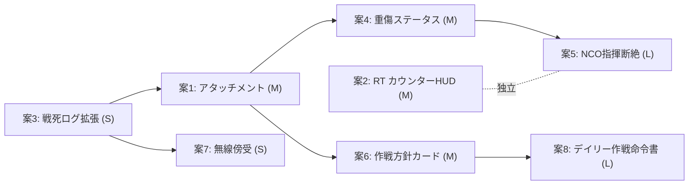

# Wildfrost のスルメ要素 → SQUAD TACTICS 翻案調査

**作成**: 2026-06-12
**目的**: デッキ構築型ローグライク *Wildfrost*（Deadpan Games / Gaziter, 2023）の「繰り返し遊びたくなる」中毒構造を分解し、WW2リアリズム85%を維持したまま `squad_tactics` に接ぎ木できる要素を5〜8案、実装規模付きで提案する。

**関連ドキュメント**

| ドキュメント | 内容 |
|-------------|------|
| [DESIGN_DIRECTION.md](./DESIGN_DIRECTION.md) | 知略ダイヤル・NCO・装備交換などの正本 |
| [GAMEPLAY_RT_TACTICS_VISION.md](./GAMEPLAY_RT_TACTICS_VISION.md) | RT × 知略二層融合 |
| [../BATTLE_SCALE_NOTES.md](../BATTLE_SCALE_NOTES.md) | classic / chaos プリセット |

---

# 1. Wildfrost のコアメカニクス調査

## 1.1 カウンター（Counter）— 自動発火のテンポ装置

各カード（リーダー・コンパニオン・敵）は「カウンター」を持つ。毎ターン -1 され、0 になると**自動的に攻撃・アビリティを発火**してカウンターが最大値にリセットされる。敵側が先にカウントダウンするため、「あと何ターンで誰が撃つか」を逆算するパズルが常時発生する。

> Each unit card comes with its own attack counter, which counts down every turn... Every turn, each card's Counter counts down by 1, with enemies counting down first. When a card's Counter reaches 0, it triggers.
> — [Counter - Wildfrost Wiki](https://wildfrostwiki.com/Counter)

**スルメ性**: プレイヤーは手出しのカードを1枚に絞られる代わりに、**「次に誰が発火するか」の見える残弾時計**を常時睨むことになる。これがターン制でも「リアルタイム感」を生む。

## 1.2 コンパニオン — 配置・身代わり・編成エンジン

1ターンに使えるカードは1枚。代わりに盤面に出した**リーダー＋コンパニオン**で「エンジン」を組む。被弾要員として身代わりに置く、位置をスワップして守る、リーダーへの致死打を防ぐなど、**盤面の駒そのものがリソース**になる。

> Instead of playing multiple cards in a turn, you'll be aiming to create an engine with your leader and companion cards... placing companion units on the board to body-block damage, rearranging units to keep them alive...
> — [Wildfrost Review in 3 Minutes](https://www.escapistmagazine.com/wildfrost-review-in-3-minutes/)

## 1.3 チャーム（Charm）— 取り外し不能の永続強化＝愛着のロック

チャームは戦闘間で手に入る装着型バフ。**一度装着すると外せない**。装着先のコンパニオンが死ねばチャームも消える。

> Once you equip a companion with a charm, you're not able to unequip it, and, if the companion dies, the charm will be gone, too.
> — [Wildfrost Review in 3 Minutes](https://www.escapistmagazine.com/wildfrost-review-in-3-minutes/)

代表的なチャームの例（[Wildfrost Wiki - Category:Charms](https://wildfrostwiki.com/Category:Charms)）: Balance Charm（カウンター調整）、Sun Charm（毎ターン回復）、Block Charm（ブロック付与）、Punchfist Charm（攻撃強化）など。

**スルメ性**: 「外せない」という不可逆性が**その個体への愛着とリスク評価を同時に発生させる**。強チャームを積んだコンパニオンの死は単なるロス以上の心理的痛みになる。

## 1.4 インジュリー（Injury）と Bell of Death — 死の重みを後引きさせる

`v1.1.0` のストームベル「Bell of Death」を有効にすると、戦闘で死亡したコンパニオンは**次の戦闘開始時に「負傷」状態**（HP・攻撃が半減）として復帰する。1戦を生き延びれば全快する。

> The Bell of Death causes companions to temporarily become injured when they die in battles, with their Health and Attack halved until you win the next battle... An injured companion heals completely after surviving a whole battle.
> — [Wildfrost: How Do Injuries Work | Gameranx](https://gameranx.com/features/id/461863/article/wildfrost-how-do-injuries-work-tips-tricks-guide/), [sharkgameshq.com](https://sharkgameshq.com/wildfrost-injured/)

## 1.5 リーダー選択（Leader / 3 Tribes）— ランの個性とビルドの軸

ランは3つの部族（Snow Dwellers / Shademancers / Clunkmasters）からランダムに選ばれたリーダーで開始。リーダーの種族テーマがそのランで出現するカードプールやシナジー方向性を決める。

> ...starting with a randomly generated leader from one of three tribes—Snow Dwellers (elemental mastery), Shademancers (summon spirits), and Clunkmasters (crafting tools/weapons).
> — [Wildfrost: Painfully Addictive - PC Review](https://www.thegamecrater.com/wildfrost-painfully-addictive-pc-review/)

**リーダー死亡＝即ゲームオーバー**という縛りが、「リーダーを守るための盤面構築」という全プレイの軸を作る。

> If your leader dies, your run is over...
> — [Wildfrost Review in 3 Minutes](https://www.escapistmagazine.com/wildfrost-review-in-3-minutes/)

## 1.6 クラウン（Crown）— ラン全体に効く恒久パッシブ

クラウンは初回ボス撃破後に必ず1個選べる、ラン全体に作用する強力な恒久効果。以後は商人（Woolly Snail）から購入も可能。

> A Crown will always be offered after defeating the first boss. Crowns are mainly purchased from The Woolly Snail and cost 75 Blings.
> — [Crowns - Wildfrost Wiki](https://wildfrostwiki.com/Crowns)

## 1.7 ベル（Bell）— ボス前の「自分で難度を盛る」儀式

ボス撃破報酬として「サンベル」を選択でき、サンベルを一定数集めると「ストームベル」（Titan Bell＝ボス強化、Swarm Bell＝増援テンポ短縮、Bell of Death＝インジュリー導入 等）が有効化される。**プレイヤーが自発的に難度を上げてリワードを増やす**仕組み。

> The first boss gives 3 Sun Bells, 2 Charms, and a Crown to choose from... Storm Bells include the Titan Bell which upgrades Bosses and Minibosses with Charms, and the Swarm Bell which reduces Enemy Wave Bell counter during Boss Battles.
> — [Bells - Wildfrost Wiki](https://wildfrostwiki.com/Bells)

## 1.8 リプレイ動機の構造 — デイリー/チャレンジ/ビルド多様性

- **デイリーボヤージ**: 固定デッキ・固定シードで全プレイヤー共通のランを1日1回だけ挑戦できる。グローバルリーダーボード付き。
  > Daily runs offer global leaderboard competition with preset decks and modifiers... while you only get one attempt to challenge it each day.
  > — [Wildfrost Mobile Review - Pocket Tactics](https://www.pockettactics.com/wildfrost/review), [GameFAQs Daily Voyage Guide](https://gamefaqs.gamespot.com/switch/367615-wildfrost/faqs/80551)
- **手続き生成 + 3部族**: ランごとにカードプール・初期構成が変わり「2回同じ展開がない」。
  > With three tribes offering fundamentally different approaches, and procedural generation ensuring no two runs play identically, Wildfrost has that addictive "one more run" quality...
  > — [Wildfrost: Painfully Addictive - PC Review](https://www.thegamecrater.com/wildfrost-painfully-addictive-pc-review/)
- **アンロックによる再訪価値**: チャレンジ完了で新しいカード・チャーム・部族が解禁され、後続ランの組み合わせ空間が広がる。
  > ...every run becomes more varied as extra tribes, cards, and charms are unlocked by completing challenges.
  > — [Wildfrost: Painfully Addictive - PC Review](https://www.thegamecrater.com/wildfrost-painfully-addictive-pc-review/)

## 1.9 「なぜ繰り返し遊びたくなるか」— 構造の抽出

```mermaid
flowchart TB
  A[カウンター可視化\n＝発火タイミングのパズル] --> E[盤面が"自分の小隊"になる]
  B[コンパニオン身代わり\n＝盤面の駒がリソース] --> E
  C[チャーム不可逆装着\n＝個体への愛着+リスク] --> E
  D[リーダー=即終了条件\n＝守るべき核] --> E
  F[インジュリー\n＝死の痛みを次戦へ後引き] --> G[「次は守れた」という\n学習満足]
  E --> G
  H[クラウン/ベル\n＝自発的難度盛り] --> I[ラン毎に違う\nビルド・物語]
  J[3部族+手続き生成] --> I
  K[デイリー/アンロック] --> L[戻ってくる外的フック]
  G --> L
  I --> L
```

要約すると、Wildfrostの中毒構造は

1. **テンポの可視化**（カウンター）でターン制に「間に合うか」のリアルタイム感を持たせる
2. **盤面の駒＝個体史**にする（チャーム不可逆・インジュリー・コンパニオン身代わり）ことで、ランごとに**唯一の物語**が生まれる
3. **守るべき核（リーダー）**を設定し、その周りに編成の意味を集約する
4. **自発的な難度盛り（ベル/クラウン）**でリプレイごとの「型」を変えさせる
5. **外的フック（デイリー・アンロック）**で「今日もやる理由」を作る

---

# 2. squad_tactics 既存システムとの対応関係

## 2.1 DESIGN_DIRECTION.md からの要点

| 既存システム | ファイル | Wildfrost との近さ |
|-------------|---------|---------------------|
| **知略ダイヤル**（chaos/classic, attack/defence, 狂気/冷静 + レゾナンス共振） | `data.js` `BATTLE_SCALE_PRESETS`, `tactics_morph.js`（将来） | Wildfrost の**3部族**＝ランの個性に近い。ただし ST はラン開始時固定ではなく**作戦前ノブ**で連続値 |
| **NCO（下士官）エリア支配構想** | DESIGN_DIRECTION §下士官 | Wildfrost の**リーダー**（死亡=ゲームオーバーの核）に近い。ST では「死亡=即終了」ではなく「局所バフ消失」 |
| **AUTO vs 手動の二面性** | DESIGN_DIRECTION §プレイ哲学 | Wildfrostの「カウンター任せ（自動発火）vs 手出し1枚」の緊張感に類似 |
| **同一ヘックス装備交換 Phase A〜C** | `phaser_bridge.js` (`FEATURE_SAME_HEX_TRANSFER`), `transferEquipment` | チャーム装着の「操作面」の土台になり得る |
| **RT 知略二層融合** | `GAMEPLAY_RT_TACTICS_VISION.md`, `logic_ai.js` `executeSimultaneous` | カウンターの「見える発火タイマー」に対応させやすい |

## 2.2 SKILLS（data.js）— 個体の永続パーク

`data.js:154-177` の `SKILLS` は9種（精密・通信・隠密・弾薬・強装・修理・防弾・英雄・白兵）。各兵士の `unit.skills` 配列に格納され、地図上バッジ（`SKILL_STYLES`）として可視化される。

```javascript
const SKILLS = {
    "Precision": { name: "精密", desc: "命中+15%" },
    "Radio":     { name: "通信", desc: "支援効果UP" },
    "Ambush":    { name: "隠密", desc: "回避+15%" },
    "AmmoBox":   { name: "弾薬", desc: "予備弾数UP" },
    "HighPower": { name: "強装", desc: "Dmg+20%" },
    "Mechanic":  { name: "修理", desc: "毎ターン回復" },
    "Armor":     { name: "防弾", desc: "被ダメ-5" },
    "Hero":      { name: "英雄", desc: "AP+1" },
    "CQC":       { name: "白兵", desc: "近接反撃" }
};
```

→ これは **Wildfrost のチャーム効果に最も近い「効果カタログ」**。現状の付与経路は2つ:

1. **`promoteSurvivors()`**（`logic_campaign.js:574-587`）— セクター生存ごとに70%でランダムスキルを付与（最大8個）。5セクター生存で `"Hero"`（AP+1）確定付与。
2. **`generateFusionData()`**（`phaser_bridge.js:7-19`）— カード融合時に1〜3個のランダムスキルセットを生成し、`fusionData.skills` として新ユニットに継承。

## 2.3 融合（fusion）— Wildfrost のチャーム不可逆性に最も近い既存機構

`phaser_bridge.js` の `FUSABLE_UNIT_TYPES`（rifleman / scout / gunner / sniper / mortar_gunner / tank_pz4 / tank_tiger）は、手札上で同種カードをドラッグ&ドロップで重ねると融合する。

```javascript
const FUSABLE_UNIT_TYPES = ['rifleman', 'scout', 'gunner', 'sniper', 'mortar_gunner', 'tank_pz4', 'tank_tiger'];

function generateFusionData() {
  const skillKeys = Object.keys(SKILLS).filter(z => z !== 'Hero');
  const count = 1 + Math.floor(Math.random() * 3);
  // ... ランダムに1-3スキルを選出
  const hpBoost = 0.05 + Math.random() * 0.10;
  const apBonus = Math.random() < 0.15 ? 1 : 0;
  return { skills, hpBoost, apBonus };
}
```

`logic_campaign.js:318-369 createSoldier()` で `fusionCount` に応じて `Math.pow(2, count - 1)` スケールの HP/AP ブーストとスキル一式が**新ユニットに焼き込まれる**。虹色オーラ VFX（`rainbowGraphics`, `fusionCandidateGraphics`）で視覚的に強調済み。

→ **「融合済みユニットが戦死するとスキル一式が失われる」**という非可逆性は、現状はまだ明示的に強調されていない（戦死ログに `(${skills.join(', ')})` が出るのみ）。ここが Charm のロス感を移植する自然な接続点。

## 2.4 戦死ナラティブ — 既に「古参兵」の物語フックがある

`logic_game.js:748-760 applyDamage()`:

```javascript
if (target.hp <= 0 && !target.deadProcessed) {
  target.deadProcessed = true;
  this.ui.log(`>> ${target.name} を撃破！`);
  if (target.team === 'player' && !target.def?.isTank) {
    const sectors = target.sectorsSurvived || 0;
    const skillTxt = (target.skills && target.skills.length) ? `（${target.skills.join(', ')}）` : '';
    if (sectors > 0) {
      this.ui.log(`☠ ${target.name}${skillTxt} 戦死 — ${sectors}セクターを生き抜いた古参兵だった`);
    } else {
      this.ui.log(`☠ ${target.name} 戦死`);
    }
  }
  ...
}
```

→ すでに「セクター生存数」と「保持スキル一覧」を**戦死ログに出す土台**がある。Wildfrostのチャーム/インジュリー演出を、この1行ログの拡張として接ぎ木しやすい。

## 2.5 RT 同時発火（カウンター不在）

`logic_ai.js:135-200 executeSimultaneous()` は `waves`（既定5波）× `stagger`（90-480ms ランダムディレイ）で AI の同時射撃を演出する。**個体ごとの「次に撃つまでの残りターン数」のような可視カウンターは未実装**。`actor.ap`（行動力）が実質的な「残弾」だが、UI上で数値カウントダウンとして強調されていない。

## 2.6 BattleCloud（圧制）— 既存の戦場圧力システム

`battle_cloud.js` の `window.BattleCloud` は `getIntensity`, `getIntruderPressure`, `getDefenseMultiplier`, `getDamageTakenMultiplier`, `getOutgoingDamageMultiplier` を提供し、密集・進入による被ダメ/出力ダメージ補正を行う。Wildfrostには直接対応物がないが、**「狂気/冷静ダイヤル」と組み合わせると「弾幕の中で発火タイミングを読む」体験の土台になる**。

---

# 3. 翻案設計 — Wildfrost要素 × squad_tactics 接ぎ木案

各案は「WW2リアリズム85%」を崩さない範囲（= 超自然要素・ファンタジー的"チャーム"ではなく、**実在しうる軍装・慣習・通信・記録**として再解釈）で設計する。

## 案一覧（概要表）

| # | 案名 | Wildfrost対応 | 接ぎ木先 | 規模 |
|---|------|---------------|----------|------|
| 1 | お守り/戦場改造アタッチメント | Charm（不可逆装着） | `unit.skills` + 同一ヘックス装備交換（Phase A/B） | M |
| 2 | RT射撃テンポ・カウンターHUD | Counter（発火タイマー） | `logic_ai.executeSimultaneous`, `actor.ap` | M |
| 3 | 古参兵の最期ログ拡張 | 戦死の重み + Injury | `applyDamage()` 戦死ログ, `promoteSurvivors()` | S |
| 4 | 戦闘後「負傷者」ステータス | Injury / Bell of Death | `resupplySurvivors()`, `onSectorCleared()` | M |
| 5 | NCO＝小隊リーダー（守るべき核） | Leader（死亡=ラン終了） | NCOビジョン（DESIGN_DIRECTION §NCO） | L |
| 6 | 作戦方針カード（doctrine crown） | Crown（恒久ラン効果） | 知略ダイヤル・レゾナンス共振 | M |
| 7 | 増援前の「無線傍受」儀式 | Bell（自発的難度盛り） | `onSectorCleared()` 報酬画面 | S |
| 8 | デイリー作戦命令書 | Daily Voyage + リーダーボード | キャンペーン全体（新規モード） | L |

---

## 案1: お守り/戦場改造アタッチメント（Charm の翻案）— 規模 M

### コンセプト

WW2文脈での「チャーム」は超自然装飾品ではなく、**兵士個人が戦場で施した改造・私物**として表現する: 望郷の写真を貼った銃床、火薬で焼いたジッポーのお守り、現地調達のスコープ、補強巻いたグリップテープ等。

### ルール

- 装備スロット（`unit.hands` / `unit.bag`）の中に「アタッチメント枠」を1〜2個追加（武器本体とは別管理）
- アタッチメントは戦闘後の報酬画面（`onSectorCleared`）で稀に出現。装着すると**`unit.skills` に1エントリを永久追加**し、**取り外し不可**（既存の `SKILLS` カタログ＝弾薬・精密・防弾等を再利用）
- そのユニットが戦死すると、アタッチメントの効果も完全消滅（既存の `戦死...（${skills.join(', ')}）` ログがそのまま「失ったもの」の記録になる）

### 接ぎ木先

- `SKILLS` / `SKILL_STYLES`（`data.js:154-177`）をそのまま再利用（新規アイコン不要、既存🎯📻🌙📦💥🔧🛡⭐⚔を流用可）
- `onSectorCleared()`（`logic_campaign.js:537`）の報酬カード一覧に「アタッチメント付与カード」を追加
- 装着UIは Phase A 同一ヘックス装備交換（`FEATURE_SAME_HEX_TRANSFER`）のドラッグ操作を流用

### WW2リアリズム維持の工夫

- 名称例: 「家族の写真（士気+）」「鹵獲双眼鏡（索敵+）」「補強スリング（強装+）」「凍傷防止手袋（防弾+）」「野戦聖書（隠密…ではなく士気回復）」
- 効果数値は既存 `SKILLS` の範囲内（命中+15%等）に収め、ファンタジー的な特殊能力を避ける

---

## 案2: RT射撃テンポ・カウンターHUD（Counter の翻案）— 規模 M

### コンセプト

Wildfrostのカウンターは「あと何ターンで発火するか」を可視化する。ST の RT 同時射撃（`executeSimultaneous`）に、**個々の兵士が「次の連射までの残りAP/弾倉サイクル」を視覚的にカウントダウンする小型バー**を追加し、知略レイヤーで「次の一斉射撃のタイミングを読んで指示を出す」プレイを生む。

### ルール

- 各ユニットの `actor.ap`（残りAP）と装填サイクル（`burst`, `rld`）を組み合わせ、「次に発火するまでのウェーブ数」を **0..N のドットカウンター**としてユニット上に表示
- カウンターが0になる瞬間（= そのウェーブで発火）に枠が光る・SE が鳴る（既存 `Sfx.play()` パターンを利用）
- 知略レイヤー側では「このカウンターが揃うタイミングで一斉射撃カードを切る」という新しい判断軸が生まれる（既存の「古式斉射」レゾナンスピークと相性が良い）

### 接ぎ木先

- `logic_ai.js:135-200 executeSimultaneous()` の `waves` ループにカウンター更新処理を追加
- 表示は `phaser_unit.js` のユニットスプライト上にバッジ追加（既存 `SKILL_STYLES` バッジ表示と同じレイヤー構造を再利用）
- `BATTLE_SCALE.RT_AI_WAVES`, `RT_WAVE_GAP_MS` は既存値をそのまま使用可能

### WW2リアリズム維持の工夫

- 「カウンター」という抽象表示ではなく、**「次弾再装填まで」「斉射号令まで」のような実際の軍事用語付きゲージ**として説明する
- 数値はあくまで既存の AP/burst/reload を可視化しただけ — 新規パラメータの追加は最小限

---

## 案3: 古参兵の最期ログ拡張（戦死の重み翻案）— 規模 S

### コンセプト

既存の戦死ログ「☠ ${target.name}${skillTxt} 戦死 — Nセクターを生き抜いた古参兵だった」を拡張し、**Wildfrostのチャーム消失演出に相当する「失った資産」のサマリー**を表示する。

### ルール

- 戦死時、`unit.skills`（永続パーク = アタッチメント、案1導入後）と `unit.fusionCount`（融合段階）を**「この兵士と共に失われたもの」として明示**
- 例: `☠ Robert J. Smith 戦死 — 3セクター, 融合段階2, 携行品: 鹵獲双眼鏡・補強スリング を喪失`
- 戦闘終了後の `onSectorCleared()` 画面に「戦没者名簿」セクションを追加（既存報酬カードの下に簡易リスト表示）

### 接ぎ木先

- `logic_game.js:748-760 applyDamage()` のログ文字列を拡張するのみ
- 戦没者リストは `this.campaign` 側に配列を持たせ、`onSectorCleared()` の DOM 構築（`reward-cards` 周辺）に追記

### WW2リアリズム維持の工夫

- 演出は「戦死公報」「戦友会記録」のようなテキストトーンに統一し、Wildfrostのようなコミカルさは排除
- 数値の喪失（HP/AP補正）はログでは語らず、「装備・経験」という資産の喪失として語る

---

## 案4: 戦闘後「負傷者」ステータス（Injury / Bell of Death の翻案）— 規模 M

### コンセプト

Wildfrostの「Bell of Death → 次戦は負傷状態で復帰、1戦生き残れば全快」を、**「重傷判定」**としてWW2文脈に翻案する。撃破ではなく「行動不能（戦線後送）」となった兵士は、次セクターで一時的にステータス低下した状態で復帰し、1セクター生存すれば「後方病院から帰還＝全快」とする。

### ルール

- 現状 `applyDamage()` は HP <= 0 で即「戦死」扱い。これに加えて**新ステータス `unit.wounded`**を導入: HPが0になった瞬間、一定確率（例: スキル `Mechanic` 保持者は確率UP）で「戦死」ではなく「重傷後送」となり、`deadProcessed` のみ立てて盤面除外。ただし `survivingUnits` には残す
- 次セクター開始時（`createSoldier` 再構築 or `resupplySurvivors()`）、`wounded === true` のユニットは `maxHp`/`maxAp` を半減して登場
- そのセクターを生存（`sectorsSurvived` カウント成功）すれば `wounded = false` に戻し全快

### 接ぎ木先

- `logic_game.js:748` `applyDamage()` に重傷判定の分岐を追加
- `logic_campaign.js:574 promoteSurvivors()` / `589 resupplySurvivors()` に重傷ステータスの回復ロジックを追加
- UIには既存の `SKILL_STYLES` バッジと並べて「重傷」アイコン（例: 🩸 赤十字風）を表示

### WW2リアリズム維持の工夫

- 「即死 vs 後方送還」は実際の戦場負傷の比率（多くの負傷者は後送され回復する）に合致し、リアリズムを損なわない
- 確率判定は「衛生兵の有無」「Mechanicスキル＝応急処置」等の既存要素と自然に結びつく

---

## 案5: NCO＝小隊リーダー（守るべき核、Leader の翻案）— 規模 L

### コンセプト

Wildfrostの「リーダー死亡=ラン即終了」をそのまま移植するのはWW2の編成上不自然（小隊長が死んでも作戦は続く）。代わりに、DESIGN_DIRECTION既存の **NCO（下士官）エリア支配構想**を、「NCO戦死 = そのエリアのボーナス完全消失 + 部下の士気急落（一時的にAUTO操作不能/精度低下）」という**ローカルな"ほぼ終了"イベント**として実装する。

### ルール

- NCOユニットに `isNCO: true` フラグと局所 `(d1,d2,d3)` ダイヤル値を付与（DESIGN_DIRECTION §下士官の Phase 1 相当）
- NCOの Command Radius 内の味方は、NCO生存中は局所レゾナンスボーナスを受ける
- **NCO戦死時**: 半径内の味方は数ターン「指揮断絶」状態（命中率ペナルティ、AUTO挙動が`狂気`側へ偏る）になる — Wildfrostの「リーダー死亡=即終了」のスケールを「小隊単位の危機」に縮小再現
- NCOが融合（案1のアタッチメント等で強化済み）されていた場合、その喪失はより重い演出（案3のログ拡張と連動）

### 接ぎ木先

- DESIGN_DIRECTION.md「下士官（NCO）と戦術ダイヤル」セクションの Phase 0-3 をベースに実装
- `tactics_morph.js`（将来実装）に局所ダイヤルの適用ロジックを追加
- 指揮断絶の効果は既存 `BattleCloud` の `getDamageTakenMultiplier` 等のマルチプライヤー機構を再利用

### WW2リアリズム維持の工夫

- 「指揮官を失った部隊の混乱」は史実的に頻出する現象であり、ファンタジー要素なしでWildfrostの緊張感を再現できる

---

## 案6: 作戦方針カード（doctrine crown、Crown の翻案）— 規模 M

### コンセプト

Wildfrostの「クラウン＝ラン全体の恒久パッシブ」を、既存の**知略ダイヤル・レゾナンス共振**システムと統合する。セクター1クリア後、プレイヤーは「作戦方針カード」を1枚選択し、それが**そのキャンペーン全体のダイヤル基準点を固定シフト**させる。

### ルール

- 例: 「電撃戦ドクトリン」を選択 → `(d1,d2,d3)` のベース値が `(chaos↑, attack↑, 冷静↑)` 方向に永久シフト（既存の「電撃戦」レゾナンスピーク定義をそのまま再利用）
- 他の例: 「弾薬節約令」（消耗↔保存ダイヤルを保存側に固定）、「斉射教範」（古式斉射ピークに恒久ボーナス）
- 1キャンペーンに1枚のみ選択可（Wildfrostの「初回ボス後に必ず1個」を模倣）。以後のセクターで追加方針は「補給」報酬の代わりとして稀に出現

### 接ぎ木先

- `DESIGN_DIRECTION.md` の `resonancePeak()` / `triResonance()` 関数群（`tactics_morph.js` 将来形）に「恒久シフト値」を加算する仕組みを追加
- 報酬画面 `onSectorCleared()` に「作戦方針カード」選択UIを追加（既存の `reward-cards` 構造を再利用）

### WW2リアリズム維持の工夫

- 「ドクトリン（教範・作戦方針）選択」は実際の軍隊運用の概念そのものであり、リアリズムに完全合致

---

## 案7: 増援前の「無線傍受」儀式（Bell の翻案）— 規模 S

### コンセプト

Wildfrostの「ベル＝自発的難度盛り→報酬増」を、**「無線傍受で増援が近いと分かったが、迎撃すれば鹵獲品が増える」**という選択儀式として翻案する。

### ルール

- セクタークリア後の報酬画面で、「無線傍受: 敵増援部隊を確認」という追加カードを選択可能に
- 選択すると次セクターの敵数が `BATTLE_SCALE.ENEMY_PER_SECTOR` 分だけ増加する代わりに、報酬カード（新兵/迫撃砲兵/鹵獲戦車/補給）の選択肢が1枚増える、または鹵獲戦車の出現率が上昇
- 複数回選択すると累積し、Wildfrostのストームベル同様「自分で難度を盛っていく」感覚を再現

### 接ぎ木先

- `onSectorCleared()`（`logic_campaign.js:537-568`）の報酬カード配列に追加
- 難度増分は既存の `BATTLE_SCALE_PRESETS` の `ENEMY_PER_SECTOR`, `ENEMY_TANK_CHANCE` 等を一時加算するだけで実装可能

### WW2リアリズム維持の工夫

- 「無線傍受による増援確認」「迎撃して鹵獲」という文脈は史実的にあり得るシチュエーションであり違和感がない

---

## 案8: デイリー作戦命令書（Daily Voyage の翻案）— 規模 L

### コンセプト

Wildfrostのデイリーボヤージ（固定シード・1日1回・リーダーボード）を、「本日の作戦命令書」として翻案する。日付ベースのシードでマップ・初期編成・知略ダイヤル基準値・作戦方針カード（案6）を固定し、1日1回だけ挑戦できるモードを追加する。

### ルール

- 日付文字列（例: `2026-06-12`）をシードとして PRNG を初期化し、`pickEnemyTemplate`・初期配置・案6の作戦方針を固定生成
- スコア（生存セクター数、戦没者数、撃破数等）をローカルストレージに記録（オンラインリーダーボードは将来拡張）
- 既存のキャンペーン進行とは独立した「本日の作戦」エントリポイントをタイトル画面に追加

### 接ぎ木先

- `CampaignManager`（`logic_campaign.js`）に `DailyOperationManager` を新設し、シード付きRNGで既存の生成関数（`createSoldier`, `pickEnemyTemplate` 等）を呼ぶ
- UIは既存タイトル/セットアップ画面（`setup-cards` 周辺）に「本日の作戦」ボタンを追加

### WW2リアリズム維持の工夫

- 「本日の作戦命令書」という名称はそのまま軍隊用語であり、Wildfrostのゲーム的な「デイリーチャレンジ」表現をリアリズムに合わせて言い換えるだけで成立する

---

# 4. 実装優先度の提案



| 優先 | 案 | 理由 |
|------|----|------|
| 1 | 案3（S） | 既存ログ文字列の拡張のみ。最小コストで「戦死の重み」を即強化 |
| 2 | 案1（M） | `SKILLS` カタログを再利用するため新規データ追加が少ない。Wildfrostのチャーム不可逆性の核を移植 |
| 3 | 案7（S） | 報酬画面に1枚追加するだけ。自発的難度盛りの手触りを早期に確認できる |
| 4 | 案4（M） | 案1で「失うものの重み」が増した後に導入すると効果が際立つ |
| 5 | 案6（M） | 知略ダイヤル・レゾナンスという既存設計と直結し、相乗効果が大きい |
| 6 | 案2（M） | RT融合（`feat/rt-tactics-fusion`）の進捗に依存するため独立トラックで進行可 |
| 7 | 案5（L） | NCOビジョン自体がまだPhase 0。先行実装が前提 |
| 8 | 案8（L） | 他の案がある程度揃ってから「型」の比較対象として機能する |

---

# 5. 出典一覧

- [Counter - Wildfrost Wiki](https://wildfrostwiki.com/Counter)
- [Charms - Wildfrost Wiki](https://wildfrostwiki.com/Charms)
- [Category:Charms - Wildfrost Wiki](https://wildfrostwiki.com/Category:Charms)
- [Crowns - Wildfrost Wiki](https://wildfrostwiki.com/Crowns)
- [Bells - Wildfrost Wiki](https://wildfrostwiki.com/Bells)
- [Wildfrost Review in 3 Minutes – A Fresh, Unique Deck-Building Roguelike (Escapist Magazine)](https://www.escapistmagazine.com/wildfrost-review-in-3-minutes/)
- [Wildfrost: Painfully Addictive - PC Review (The Game Crater)](https://www.thegamecrater.com/wildfrost-painfully-addictive-pc-review/)
- [Wildfrost mobile review - a pain in the deck, in the best way possible (Pocket Tactics)](https://www.pockettactics.com/wildfrost/review)
- [Wildfrost - Daily Voyage Guide - Nintendo Switch (GameFAQs)](https://gamefaqs.gamespot.com/switch/367615-wildfrost/faqs/80551)
- [Wildfrost: How Do Injuries Work | Tips & Tricks Guide (Gameranx)](https://gameranx.com/features/id/461863/article/wildfrost-how-do-injuries-work-tips-tricks-guide/)
- [Wildfrost Injuries Guide: Can Companions Die Permanently? (Shark Games HQ)](https://sharkgameshq.com/wildfrost-injured/)

---

# 変更履歴

| 日付 | 内容 |
|------|------|
| 2026-06-12 | 初版 — Wildfrostコアメカニクス調査・既存システム対応・翻案案8件（案1-8）・優先度提案 |
