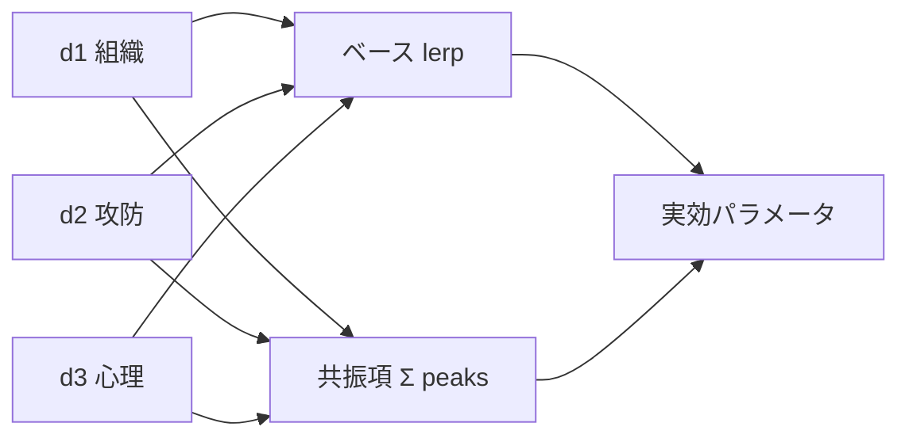
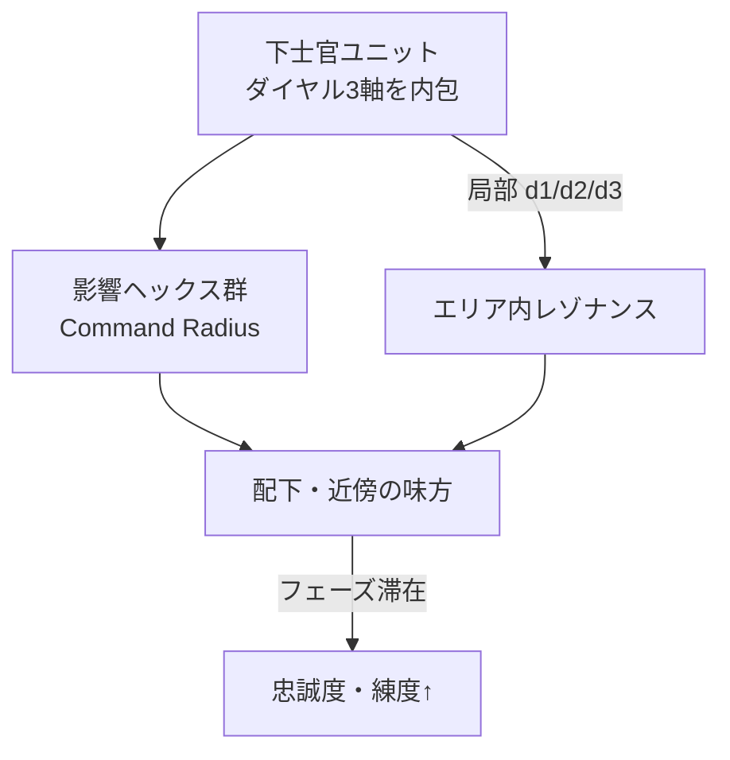

# SQUAD TACTICS — 設計方針・課題ロードマップ

> **アーカイブ済（2026-07-02）**: 方針は docs/NORTH_STAR.md に継承・裁定済み。データパイプライン章は docs/DATA_PIPELINE.md へ移設。

**更新**: 2026-05-25  
**目的**: 散在するビジョン・課題・データ方針を一箇所に集約する。実装の判断はここを正本とし、詳細仕様は各専門ドキュメントへリンクする。

**関連ドキュメント**

| ドキュメント | 内容 |
|-------------|------|
| [ARCHITECTURE.md](../ARCHITECTURE.md) | 起動フロー・モジュール責務 |
| [BATTLE_SCALE_NOTES.md](../BATTLE_SCALE_NOTES.md) | classic / chaos 数値プリセット |
| [GAMEPLAY_RT_TACTICS_VISION.md](./GAMEPLAY_RT_TACTICS_VISION.md) | RT × 知略二層融合 |
| [WEAPON_ASSETS_ROADMAP.md](../WEAPON_ASSETS_ROADMAP.md) | 武器ビジュアル・PL 統一 |
| [USER_MANUAL.md](../USER_MANUAL.md) | プレイヤー向け操作説明 |
| [PL_AMMO_UI_FILTER.md](./PL_AMMO_UI_FILTER.md) | 装填 u27 形状フィルタ調査 |
| [PL_AMMO_TRUTH.md](./PL_AMMO_TRUTH.md) | **装填正本・override 方針**（CBE 優先） |
| [PL_AUX_EQUIPMENT.md](./PL_AUX_EQUIPMENT.md) | 銃剣・擲弾・弾薬箱の PL 組み合わせ |

---

# 知略ダイヤル（UI ビジョン）

## 設計原則: 浮動小数点モーフィング

- 離散プリセット（classic/chaos）だけでなく **`0.0 … 1.0` の連続値** で補間
- 各ダイヤルは複数の `BATTLE_SCALE` キーへ **lerp**（例: `lerp(classic.ENEMY_BASE, chaos.ENEMY_BASE, t)`）
- UI: 3 つのノブ + 数値表示。作戦フェーズ中も変更可（RT 中は制限可）
- シームレス体験: ワンタッチでドンパチ / マニア装備ビルドの両方が同じエンジンから
- **レゾナンス**: 単純 lerp だけでなく、**ダイヤル組み合わせによる尖ったピーク** を意図的に設計する（下記）

## レゾナンス — 組み合わせで尖る

滑らかモーフィングの目的は「中間値の探索」だけではない。**特定の `(d1, d2, d3)` 付近でボーナスやペナルティが共振して立ち上がる** と、マニアがダイヤルを「チューニング」する動機になる。

### 設計思想

| 概念 | 意味 |
|------|------|
| **ベース曲面** | 各ダイヤルは独立 lerp（平坦な土台） |
| **共振項** | 2〜3 ダイヤルの **位相の揃い** で加算される尖り |
| **ピーキー** | ガウス / ローレンツ型 — ピークは狭く、外れはベースに戻る |
| **反共振** | 相性の悪い組み合わせは **谷**（ペナルティ）— コメディ枠もここ |



### 共振ピーク例（案）

| 名称 | おおよその `(d1, d2, d3)` | 効果 | プレイ感 |
|------|---------------------------|------|----------|
| **電撃戦** | chaos↑ attack↑ 冷静↑ | 移動+命中+初動 AP | プロの強襲 — 尖ってる |
| **弾幕死守** | chaos↑ defence↑ 狂気↑ | 压制↑ 被弾軽減 弾消費↑↑ | 塹壕ドンパチ（穴倉） |
| **古式斉射** | classic↑ defence↑ 冷静↑ | 一斉射撃 bonus 命中率↑ | ソムメの一斉射撃 |
| **玉砕** | chaos↑ attack↑ 狂気↑ | 突撃 dmg↑ 士気乱 消耗↑↑ | ハイリスクハイリターン |
| **潜伏** | classic↑ attack↑ 冷静↑ | 伏撃 Ambush 系 bonus | 狙撃・奇襲特化 |

**反共振（谷）例**: classic + 狂気 + attack → 命令混乱（AUTO 精度↓）、defence + 狂気 + chaos → 「穴倉で乱射」疲弊（reload ペナルティ二重）

### 数式スケッチ（実装用）

```javascript
// tactics_morph.js 将来形
function resonancePeak(d, center, width) {
  // d: 0..1, center: ピーク位置, width: 尖り具合（小さいほどピーキー）
  const x = (d - center) / Math.max(0.05, width);
  return Math.exp(-x * x);
}

function triResonance(d1, d2, d3, c1, c2, c3, w) {
  return resonancePeak(d1, c1, w) * resonancePeak(d2, c2, w) * resonancePeak(d3, c3, w);
}

function morphWithResonance(d1, d2, d3) {
  const base = morphBattleScale(d1, d2, d3);
  const assaultPeak = triResonance(d1, d2, d3, 0.85, 0.85, 0.75, 0.12);
  const trenchPeak  = triResonance(d1, d2, d3, 0.90, 0.15, 0.90, 0.15);
  return {
    ...base,
    firstStrikeApBonus: assaultPeak * 1,
    suppressMult: base.suppressMult * (1 + trenchPeak * 0.4),
    ammoBurnMult: base.ammoBurnMult * (1 + trenchPeak * 0.6),
  };
}
```

- **width** を小さくするとピーキー（マニア向け）
- 共振は **乗算** が尖りやすい（3 つ揃ったときだけ光る）
- ピークごとに **UI 表示名**（「電撃戦モード接近」）と **SFX/色** でフィードバック

### UI / 体験

- ノブ操作中、共振度メーター or **輪郭が光る**（近づくほど明るい）
- ピーク到達時: 短い SE + サイドバーに doctrine 名表示（「Assault Doctrine Resonance」）
- NCO エリア: **下士官ごとに局部 `(d1,d2,d3)`** → 小隊単位で異なる共振（同一マップ内に複数ピーク）

### バランス原則

- ピークは **強いが狭い** — 維持に微調整が要る（株式の限界指値感）
- 反共振は **痛いが致命傷ではない** — 学習コスト
- classic/chaos だけの離散切替では出せない **第3のプレイ** が共振で生まれる

## BATTLE_SCALE ≠ AUTO トグル

| | **BATTLE_SCALE / ダイヤル** | **AUTO トグル** |
|--|------------------------------|-----------------|
| 切替 | 作戦前ノブ or `data.js`（開発時） | 戦闘中サイドバー |
| 役割 | 戦闘の**性格・組織の動き** | そのターン AI 任せ |

## ダイヤル 1: 組織様式 — chaos ↔ classic

| 極 | ラベル | プレイ感 |
|----|--------|----------|
| **1.0 chaos** | 荒唐無稽・一騎当千 | 大人数・RT 弾幕・弾薬消費・予期せぬシナジー |
| **0.0 classic** | 画一的オーケストレーション・ザ・軍隊 | 小規模・フォーメーション・一斉射撃・様子見 |

**影響パラメータ（案）**: `ENEMY_BASE`, `HEX_UNIT_CAP`, `RT_SIMULTANEOUS_AI`, `AUTO_ATTACKS_PER_ACTOR`, `RT_DAMAGE_MULT`, 増援頻度

## ダイヤル 2: 作戦姿勢 — attack ↔ defence

| 極 | ラベル | プレイ感 |
|----|--------|----------|
| **1.0 attack** | 浸透・電撃 | 移動 AP 優遇・接近戦ボーナス・压制付与側・低遮蔽ペナルティ |
| **0.0 defence** | 防禦・死守 | 掩蔽ボーナス・オーバーウォッチ強化・退却/据守報酬・被弾軽減 |

**影響パラメータ（案）**: 地形 cover 倍率, `BattleCloud` 压制, AI 攻性/退避閾値, 姿勢デフォルト, 勝利条件（確保 vs 防衛）

## ダイヤル 3: 心理 — **狂気 ↔ 冷静**（決定）

| 極 | ラベル | プレイ感 |
|----|--------|----------|
| **1.0 狂気** | 暴走・乱射 | 連射・突撃・士気乱・**弾薬消費↑**・誤射リスク |
| **0.0 冷静** | 規律・照準 | 命中率↑・慎重移動・士気安定・弾薬節約 |

**影響パラメータ（案）**: 射撃モード, morale, AI 突撃率, **`RT_DAMAGE_MULT` ではなく ammo burn / reload 頻度**

※ **カオス + 狂気 + 死守** は「ドンパチなのに塹壕に穴倉」みたいなコメディ枠。ダイヤル独立 lerp なので変な組み合わせもプレイヤーの個性として許容。

### 他候補（将来）

| 候補 | 低 | 高 | 主な影響 |
|------|----|----|----------|
| 規律 ↔ 独断 | 一斉行動 | 個兵の機転 | AUTO 分散, スキル proc |
| 消耗 ↔ 保存 | 弾潤沢 | 厳密消耗 | malfunction, 補給 |
| 集中 ↔ 分散 | 単目標 | 面压制 | ターゲット AI |

## 実装メモ

```javascript
// data.js 将来形（案）
function morphBattleScale(d1, d2, d3) {
  const c = BATTLE_SCALE_PRESETS.classic;
  const h = BATTLE_SCALE_PRESETS.chaos;
  return {
    ENEMY_BASE: lerp(c.ENEMY_BASE, h.ENEMY_BASE, d1),
    RT_SIMULTANEOUS_AI: d1 > 0.35,
    // d2, d3 は別モジュール（tactics_morph.js）へ
  };
}
```

※ UI 未着手。現行は `BATTLE_SCALE_PRESET` 離散切替のみ（[BATTLE_SCALE_NOTES.md](../BATTLE_SCALE_NOTES.md)）。

---

# 下士官（NCO）と戦術ダイヤル — エリア支配ビジョン

グローバルな 3 ダイヤルだけでなく、**特定の下士官ユニットが「自分の戦術」を持ち、影響エリアで作用する** 案。

## コンセプト



| 要素 | 内容 |
|------|------|
| **担持者** | Sergeant / 班長級。1 小隊に 1 名など |
| **ダイヤル** | その NCO 個人の `d1/d2/d3`（chaos/classic, atk/def, 狂気/冷静） |
| **影響範囲** | NCO から N ヘックス（士気・技能パラメータに連動可） |
| **滞在ボーナス** | 影響下で **プレイヤーフェーズを過ごすほど** 忠誠度・練度が蓄積 |
| **局部共振** | NCO の `(d1,d2,d3)` がエリア内の **レゾナンス曲面** — 班ごとに「この配置が光る」 |
| **離脱** | NCO 戦死 / 範囲外 → ボーナス停止（ペナルティは軽め） |

## ゲームプレイ効果

- **愛着**: 「この班長の下で育った兵」が強くなる
- **位置取り**: NCO をどこに置くかが戦術（攻撃軸の先端 vs 死守の核）
- **ダイヤル個性**: 狂気高めの NCO エリア = 弾薬消費↑・压制↑／冷静 NCO = 命中・安定

## 実装フェーズ（案）

| Phase | 内容 |
|-------|------|
| 0 | グローバル morph ダイヤル（`tactics_morph.js`） |
| 1 | NCO フラグ + 固定半径 2hex の stat 補正 |
| 2 | フェーズ滞在カウンタ → 忠誠/練度 XP |
| 3 | NCO ごとに UI ミニノブ（上級者向け） |

---

# プレイ哲学: 手動 vs AUTO

**株式取引に似た二面性** を意図的に設計する。

- **AUTO** … 相場（AI）に乗る。テンポは速いが、兵士個別の「スーパーパワー」を活かしきれず **不利方向に傾きやすい**
- **手動** … 1 兵ずつ触り、装備・姿勢・弾数・位置の組み合わせでエッジを取る。**知略を練るほど有利**
- **愛着** … 兵士ごとの個性（スキル・装備・戦績）に気づくのは手動プレイの副産物

RT 融合（[GAMEPLAY_RT_TACTICS_VISION.md](./GAMEPLAY_RT_TACTICS_VISION.md)）は **作戦フェーズ（停止）** と **交戦フェーズ（流れ）** の UI 境界をはっきりさせた上で載せる。

---

# 学習曲線・チュートリアル

## 現状の問題

ランダムマップ × ランダム武器 × ランダム初期配置 = **スカーミッシュ**。深いシステムに対して初見が急すぎる。

## 方針

| フェーズ | 内容 |
|----------|------|
| チュートリアル 1–2 戦 | マップ・兵種・敵配置を**固定** |
| 段階的解放 | 小銃 → MG → 迫撃砲 → 戦車 |
| 1 マップ 1 発見 | 「同ヘックスで迫撃砲を渡す」等、1 つの操作を体験させる |

---

# UI / フィードバック

## 優先改善

1. **拒否理由の明示** — 撃てない・動けない・装填不可の理由を戦場側に表示
2. **ホバーで判断** — 命中率・適合弾/銃（LOADOUT ホバーは実装済み）
3. **アクティブ兵の射程/移動ハイライト** — XCOM 的即時フィードバック
4. **次の兵へ** — Tab サイクル or ボタン

---

# コンテンツ: 1 戦の物語

1 マップ内のドラマ設計:

- 包囲・撤退・増援到着タイミング
- 勝利条件バリエーション（確保・護衛・突破）
- ミッションイベント（砲撃支援・通信途絶）

システム先行 → **ミッション設計** が次のボトルネック。

---

# 同一ヘックス装備交換

## 課題

M2 迫撃砲（Tube + Bipod + Baseplate + 弾薬箱）を別兵士に渡す操作が多段すぎる（デッキ経由等）。

## 実装フェーズ

| Phase | 内容 | 状態 |
|-------|------|------|
| **A** | SQUAD 行（同ヘックス味方切替）+ ドラッグ → 味方チップへ渡し | **実装済** — `FEATURE_SAME_HEX_TRANSFER` |
| **B** | M2 Kit 仮想コンテナ（3 パーツ一括） | 未着手 |
| **C** | 戦場ショートカット（長押し「渡す」/ G キー） | 未着手 |

### Phase A ルール

- SELECT モード・同ヘックス・味方歩兵のみ
- AP 消費なし（装備整理 = 作戦フェーズ）
- 同一スロット種別・index へ swap 渡し
- **ロールバック**: `data.js` の `FEATURE_SAME_HEX_TRANSFER = false`

---

# 変更履歴

| 日付 | 内容 |
|------|------|
| 2026-05-25 | 初版 — 議論サマリー・知略ダイヤル・Phase A 装備交換 |
| 2026-05-25 | Phase A 実装 — `FEATURE_SAME_HEX_TRANSFER`, SQUAD 行, `transferEquipment` |
| 2026-05-25 | データ四層構造の明確化 — explicit は手書き厳選ペア（非自動抽出） |
| 2026-05-25 | PL 装填 UI フィルタ調査 — u27 形状フラグ仮説（[PL_AMMO_UI_FILTER.md](./PL_AMMO_UI_FILTER.md)） |
| 2026-05-25 | 知略ダイヤル: 浮動小数点モーフィング・3軸定義 |
| 2026-05-25 | 第2フィルタ category==18 + 付属スロット (`PL_SLOT_FILTER.md`) |
| 2026-05-25 | NCO エリア支配・忠誠/練度ビジョン |
| 2026-05-25 | ダイヤル **レゾナンス** — 組み合わせピーク・反共振 |
| 2026-05-25 | **Phase 0** — `tactics_morph.js` 知略ダイヤル lerp + 共振 |
